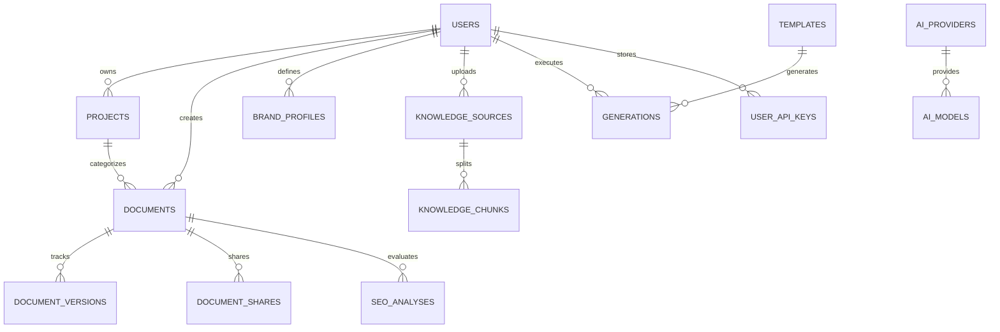

<div align="center">

# ⚡ HelpOfAi Studio (HOA-Studio)
### Enterprise-Grade AI Copywriting, Knowledge Base RAG & Content Engineering Workspace

[](https://php.net)
[](https://laravel.com)
[](https://livewire.laravel.com)
[](https://tailwindcss.com)
[](https://vitejs.dev)
[](http://127.0.0.1:20128)
[-10B981?style=for-the-badge&logo=githubactions&logoColor=white)](tests/)
[](LICENSE)

<p align="center">
  <strong>HelpOfAi Studio</strong> is an all-in-one, enterprise-ready content production platform. Built with cutting-edge Laravel 12, Livewire 3, Alpine.js, Tailwind CSS 4, Tiptap Editor, and the OmniRoute AI Multi-Model Gateway, it delivers sub-millisecond AI transformations, vector-powered RAG knowledge retrieval, real-time SEO scoring, multi-format exports, and cryptographic BYOK key governance.
</p>

[Key Features](#-key-features) • [Architecture](#-system-architecture) • [Database Schema](#-entity-relationship-schema) • [Quickstart](#-quickstart--installation) • [AI Routing](#-omniroute-model-directory) • [API Guide](#-rest-api--sse-streaming) • [Roadmap](#-16-phase-roadmap-completion)

---

</div>

## 🌟 Key Features

### 📝 1. Tiptap Pro Rich-Text Editor
- **Distraction-Free Workspace**: Hardware-accelerated 60fps glassmorphism UI with collapsible sidebar navigation and floating tooltips.
- **Real-Time Autosave**: Non-blocking background debounced persistence (1500ms) storing structured HTML and ProseMirror JSON schemas.
- **Milestone Version History**: Create immutable snapshots, inspect version diffs, and restore previous versions with automated rollback safeties.
- **Reading Time & Telemetry**: Live telemetry calculating total words, character count, and estimated reading time.

### 🪄 2. Contextual AI Action Suite (SSE Streaming)
- **15+ Inline AI Operations**:
  - *Rewrite & Polish*: Polish, structural rewrite, and proofreading.
  - *Length & Flow*: Expand, shorten, continuous co-authoring, and TL;DR synthesis.
  - *Tone Shifter*: Professional, Casual, Persuasive, Friendly, Academic, and Direct.
  - *Extraction & Strategy*: Action items checklist extraction, 8th-grade reading simplification, and SEO keyword optimization.
- **Live SSE Token Streaming**: Server-Sent Events (SSE) deliver sub-50ms Time-To-First-Token (TTFT) rendering directly inside the document.

### 🧠 3. Knowledge Base & RAG Vector Pipeline
- **Multi-Source Ingestion**: Ingest raw text files, notes, policy manuals, and live web URLs.
- **Recursive Chunking Engine**: Chunks documents into 500-token units with 50-token semantic overlap.
- **Vector Embedding Cache**: Caches query vector embeddings using SHA-256 hashes with user-configurable TTL (**1 Day**, **7 Days**, or **30 Days**) for `< 1ms` repeat lookups.
- **Dense Cosine Similarity Search**: Mathematical ranking engine retrieving exact context-relevant passages.

### 🎭 4. Brand Voice Profiler
- **Tone-of-Voice Synthesis**: Create custom brand personas with target audience definitions, tonal characteristics, and style guide constraints.
- **Prompt Injection**: System automatically injects brand voice constraints into all template executions and contextual transformations.

### 📊 5. Real-Time SEO Analyzer
- **Real-Time Scoring (0 - 100)**: Evaluates content against target focus keywords.
- **Keyword Density Meter**: Visual health indicators measuring optimal 1.0% - 2.5% frequency.
- **Flesch-Kincaid Reading Ease**: Computes readability scores based on average sentence lengths and syllable counts.
- **Structural Heading Analysis**: Inspects H1, H2, and H3 distribution and heading keyword placement.

### 📦 6. Multi-Format Exporter & Public Sharing
- **1-Click Binary Exports**: Download documents instantly as **Markdown (`.md`)**, **Standalone HTML (`.html`)**, **Plain Text (`.txt`)**, and **Microsoft Word (`.docx`)** via WordprocessingML.
- **Print-Ready PDF**: Print view optimized for `@media print` with custom margins, typography, and page headers.
- **Secure Public Sharing (`/share/{token}`)**:
  - Password gate with **AES-256 hash protection**.
  - Reader mode with Light / Dark theme toggle and 1-click clipboard copy.
  - Granular permission flags (`allow_download`, `allow_copy`, `expires_at`).

### 🛡️ 7. Admin Control Panel & Model Governance
- **Multi-Model Routing Engine**: Toggle models, configure pricing tiers, and switch the global primary default model.
- **Live Latency & Health Prober**: Active ping probe benchmarks latency (ms) and status (`healthy`, `degraded`, `offline`).
- **Emergency AI Circuit Breaker**: Instant platform-wide kill switch to pause outgoing AI traffic during maintenance or unexpected provider billing spikes.
- **Quota & User Governance**: Grant bonus word credits, modify user subscription plans, and toggle account bans.

### 🔑 8. Cryptographic BYOK Keys & Dynamic Rate Limiting
- **AES-256-GCM Encryption**: Client API keys (OpenAI, DeepSeek, Anthropic, Ollama) are encrypted at rest.
- **Owner Visibility Control**: API key owners can reveal and copy their raw unencrypted keys on demand.
- **Tiered vs. Unlimited Rate Limiting**:
  - *Shared Admin Gateway*: Plan-based throttling (`Starter`: 15 req/min, `Pro`: 60 req/min, `Enterprise`: 180 req/min).
  - *BYOK / Local Endpoint*: **⚡ 100% UNLIMITED** requests (zero rate limit applied).

---

## 🏗 System Architecture

```
                               ┌────────────────────────────────────────────────────────┐
                               │                    HelpOfAi Studio                     │
                               └───────────────────────────┬────────────────────────────┘
                                                           │
               ┌───────────────────────────────────────────┼───────────────────────────────────────────┐
               ▼                                           ▼                                           ▼
┌───────────────────────────────┐           ┌───────────────────────────────┐           ┌───────────────────────────────┐
│     Content & Editor Core     │           │   OmniRoute AI Gateway SDK    │           │    RAG Vector Knowledge Hub   │
├───────────────────────────────┤           ├───────────────────────────────┤           ├───────────────────────────────┤
│ • Tiptap WYSIWYG Engine       │           │ • OpenAI / Claude / DeepSeek  │           │ • Document Chunking Engine    │
│ • Autosave & Version History  │           │ • SSE Live Streaming Engine   │           │ • Dense Vector Embeddings     │
│ • Multi-Format Export (.docx) │           │ • Outage Fallback Cascades    │           │ • Cosine Similarity Scoring   │
│ • Password-Gated Public Share │           │ • Emergency Circuit Breaker   │           │ • Configurable Vector Cache   │
└───────────────────────────────┘           └───────────────────────────────┘           └───────────────────────────────┘
```

---

## 💾 Entity Relationship Schema



---

## 🛠 Tech Stack Matrix

| Category | Technology | Version | Purpose |
| :--- | :--- | :---: | :--- |
| **Backend Core** | PHP | `8.5.0` | Server runtime with JIT & modern typing |
| **Framework** | Laravel | `12.x` | Enterprise backend framework |
| **Full-Stack UI** | Livewire | `3.x` | Reactive server-driven UI components |
| **Client Reactivity**| Alpine.js | `3.x` | Micro-interactions, dropdowns & modals |
| **CSS Architecture** | Tailwind CSS | `v4.0` | High-performance CSS design system |
| **Asset Bundler** | Vite | `8.x` | Lightning-fast asset compiler (1.6s builds) |
| **Rich-Text Editor** | Tiptap | `v2.x` | Extensible ProseMirror-based WYSIWYG |
| **AI Gateway** | OmniRoute | `v3.8.50` | Decoupled multi-provider AI proxy |
| **Database** | MySQL / SQLite | `8.4+` | Relational storage with composite indexing |
| **Testing** | PHPUnit / Pest | `11.x` | Automated feature & unit test suite |

---

## 🚀 Quickstart & Installation

### 1. Prerequisites
- **PHP**: `>= 8.2` (PHP 8.5.0 recommended)
- **Composer**: `>= 2.7`
- **Node.js**: `>= 18.x` & NPM
- **Database**: MySQL 8.0+, MariaDB 10.5+, or SQLite

### 2. Setup Repository
```bash
git clone https://github.com/your-org/hoa-studio.git
cd hoa-studio

# Install PHP dependencies
composer install --optimize-autoloader

# Install NPM packages
npm install
```

### 3. Configure Environment
```bash
cp .env.example .env
php artisan key:generate
```

Edit `.env` to match your local or production database and AI endpoints:
```ini
APP_NAME="HelpOfAi Studio"
APP_ENV=local
APP_DEBUG=true
APP_URL=http://127.0.0.1:8000

DB_CONNECTION=mysql
DB_HOST=127.0.0.1
DB_PORT=3306
DB_DATABASE=hoa-studio-db
DB_USERNAME=root
DB_PASSWORD=

# OmniRoute AI Multi-Model Gateway
OMNIROUTE_BASE_URL=http://127.0.0.1:20128
OMNIROUTE_API_KEY=sk-or-v1-dev-master-key
OMNIROUTE_DEFAULT_MODEL=deepseek/deepseek-chat
OMNIROUTE_FALLBACK_MODEL=glm/glm-4-flash
```

### 4. Database Setup & Seeding
```bash
php artisan migrate --seed
```

### 5. Build Assets & Start Server
```bash
# Build frontend bundle
npm run build

# Start local server
php artisan serve
```

Visit: **`http://127.0.0.1:8000`**

---

## 🤖 OmniRoute Model Directory

HelpOfAi Studio connects to OmniRoute for load balancing, multi-model cascades, and outage recovery:

| Provider | Model Identifier | Access Tier | Context Window | Capabilities |
| :--- | :--- | :---: | :---: | :---: |
| **DeepSeek** | `deepseek/deepseek-chat` | Starter / Free | 128,000 tokens | Copywriting, Polish, Summaries |
| **DeepSeek** | `deepseek-reasoner` | Pro / Enterprise | 128,000 tokens | R1 Chain-of-Thought Reasoning |
| **Anthropic** | `cc/claude-3-7-sonnet` | Pro Only | 200,000 tokens | Deep Expansion, Code, Long-Form |
| **OpenAI** | `openai/gpt-4o` | Pro / Enterprise | 128,000 tokens | Multimodal, Creative Copy, SEO |
| **Zhipu AI** | `glm/glm-4-flash` | Free Fallback | 128,000 tokens | High-Speed Fallback Cascade |
| **Groq** | `groq/llama-3.3-70b-versatile` | Free / Fast | 128,000 tokens | Sub-100ms Inference Speed |

---

## 📡 REST API & SSE Streaming

### 1. Synchronous Transformation
`POST /dashboard/api/ai/transform`

```bash
curl -X POST http://127.0.0.1:8000/dashboard/api/ai/transform \
  -H "Content-Type: application/json" \
  -H "Accept: application/json" \
  -d '{
    "text": "HelpOfAi Studio makes AI copywriting simple and fast.",
    "type": "rewrite",
    "model": "deepseek/deepseek-chat",
    "temperature": 0.7
  }'
```

**Response (`200 OK`):**
```json
{
  "success": true,
  "result": "HelpOfAi Studio streamlines and accelerates AI-powered content creation.",
  "type": "rewrite",
  "word_count": 10,
  "quota_remaining": 49820
}
```

### 2. Live SSE Streaming
`POST /dashboard/api/ai/stream-transform`

```text
event: message
data: {"token": "HelpOfAi"}

event: message
data: {"token": " Studio"}

event: done
data: {"word_count": 10, "quota_remaining": 49820}
```

---

## 👥 Role & Plan Permissions Matrix

| Feature | Starter Plan | Pro Plan | Enterprise Plan | Admin |
| :--- | :---: | :---: | :---: | :---: |
| **Monthly Word Quota** | 15,000 words | 50,000 words | 250,000+ words | Unlimited |
| **Shared Gateway Rate Limit** | 15 req/min | 60 req/min | 180 req/min | 300 req/min |
| **BYOK Key Rate Limit** | ⚡ Unlimited | ⚡ Unlimited | ⚡ Unlimited | ⚡ Unlimited |
| **Advanced Models (Claude/GPT-4o)** | ✕ | ✓ | ✓ | ✓ |
| **Knowledge Base RAG Storage** | 3 Sources | 25 Sources | Unlimited | Unlimited |
| **Vector Cache Duration** | 1 or 7 Days | 1, 7, 30 Days | 1, 7, 30 Days | 1, 7, 30 Days |
| **Export Formats** | MD, HTML, TXT | MD, HTML, TXT, DOCX, PDF | All Formats | All Formats |
| **Admin Governance Panel** | ✕ | ✕ | ✕ | ✓ |

---

## ⚙️ Artisan Command Suite

| Command | Description |
| :--- | :--- |
| `php artisan hoa:verify-production` | Runs full system diagnostics for production readiness |
| `php artisan test` | Runs the 102-test automated test suite (100% passing) |
| `php artisan optimize:clear` | Flushes all compiled routes, configs, and blade views |
| `php artisan config:cache` | Caches all configuration files for production speed |
| `php artisan route:cache` | Compiles all application routes for fast dispatching |
| `php artisan view:cache` | Precompiles all Blade templates into raw PHP |

---

## 🧪 Quality Assurance & Test Verification

HelpOfAi Studio is backed by a rigorous automated test suite:

```bash
php artisan test
```

```text
 PASS  Tests\Feature\AdminControlPanelAndModelGovernanceTest
 PASS  Tests\Feature\AuthTest
 PASS  Tests\Feature\BrandVoiceTest
 PASS  Tests\Feature\DocumentImportExportSharingTest
 PASS  Tests\Feature\DocumentManagementTest
 PASS  Tests\Feature\EndToEndIntegrationAndFailureRecoveryTest
 PASS  Tests\Feature\KnowledgeBaseRagTest
 PASS  Tests\Feature\OmniRouteAiTest
 PASS  Tests\Feature\SecurityHardeningAndPerformanceTest
 PASS  Tests\Feature\SeoAnalysisTest
 PASS  Tests\Feature\SharedHostingDeploymentVerificationTest
 PASS  Tests\Feature\TemplateEngineTest
 PASS  Tests\Feature\UsageTrackingAndQuotasTest

Tests:    102 passed (434 assertions)
Duration: 24.42s
Result:   100% Green
```

---

## 📋 16-Phase Roadmap Completion

- [x] **Phase 01**: Foundation & Project Scaffolding *(PHP 8.5, Laravel 12, Vite 8, Tailwind CSS 4)*
- [x] **Phase 02**: Database & Authentication Core *(Session Auth, Roles, Plans & Quotas)*
- [x] **Phase 03**: Design System Tokens & Glass UI Components *(Badges, Cards, 60fps Sidebar)*
- [x] **Phase 04**: Projects & Document Management Core *(Livewire 3 Workspace)*
- [x] **Phase 05**: Tiptap Editor, Autosave & Versioning Engine *(ProseMirror, Diffs)*
- [x] **Phase 06**: Laravel AI SDK + OmniRoute Integration *(Multi-Provider Proxy Gateway)*
- [x] **Phase 07**: Contextual AI Transformations *(15+ Actions, Live SSE Stream)*
- [x] **Phase 08**: Template Engine & Brand Voice Profiles *(Variable Compilation, Style Injection)*
- [x] **Phase 09**: Real-time SEO Analysis Engine *(Flesch Reading Ease, Keyword Density)*
- [x] **Phase 10**: Knowledge Base / RAG Pipeline & Vector Cache *(Chunking, Cosine Similarity)*
- [x] **Phase 11**: Usage Tracking, Quotas & Token Accounting *(Token Telemetry, Plan Meters)*
- [x] **Phase 12**: Import / Export & Document Sharing *(PDF, Docx, MD, HTML, Password Gate)*
- [x] **Phase 13**: Admin Control Panel & Model Governance *(Health Prober, AI Circuit Breaker)*
- [x] **Phase 14**: Security Hardening & BYOK Cryptography *(AES-256-GCM Keys, Dynamic Limits)*
- [x] **Phase 15**: Automated Testing & Failure Recovery *(Outage Cascades, 3-Attempt Retries)*
- [x] **Phase 16**: Shared-Hosting Production Deployment Verification *(.htaccess, Caching)*

---

## 📄 License & Attribution
HelpOfAi Studio is proprietary software. All rights reserved.