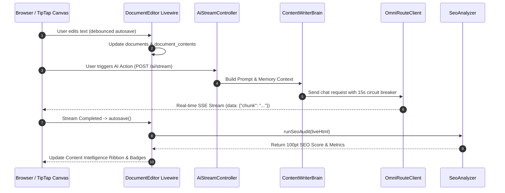

# 🧠 HOA-Studio: Neuro-Brain System Architecture Schema
<!--
|--------------------------------------------------------------------------
| HelpOfAi (HOA) Professional Software - System Architecture Schema
|--------------------------------------------------------------------------
|
| Copyright (c) 2026 Rajib Adhikary. All Rights Reserved.
| Author      : Rajib Adhikary
| Organization: HelpOfAi (HOA)
| Website     : https://helpofai.com
|--------------------------------------------------------------------------
-->

> [!IMPORTANT]
> **MANDATORY FOR ALL AI AGENTS**: Consult this neuro-brain schema **BEFORE** modifying, adding, or refactoring any code. This document maps every feature node, file path, synaptic data flow, and event bus so you can understand the complete codebase topology in seconds without re-reading thousands of files. Whenever you add or upgrade a feature, you **MUST update this schema**.

---

## 🧭 Neuro-Brain Architecture Map (Click Any Node to Jump to Its Synapse Spec)

```mermaid
flowchart TD
    %% Styling Classes (Neuro-Brain Glows)
    classDef cortex fill:#1e1b4b,stroke:#818cf8,stroke-width:2px,color:#e0e7ff;
    classDef frontal fill:#311042,stroke:#c084fc,stroke-width:2px,color:#f3e8ff;
    classDef parietal fill:#022c22,stroke:#34d399,stroke-width:2px,color:#ecfdf5;
    classDef occipital fill:#451a03,stroke:#fbbf24,stroke-width:2px,color:#fffbeb;
    classDef temporal fill:#172554,stroke:#60a5fa,stroke-width:2px,color:#eff6ff;
    classDef brainstem fill:#1f2937,stroke:#9ca3af,stroke-width:2px,color:#f9fafb;
    classDef external fill:#0f172a,stroke:#38bdf8,stroke-width:2px,stroke-dasharray: 5 5,color:#e2e8f0;

    subgraph BRAINSTEM ["🏛️ Central Brainstem (Governance, System & Updates)"]
        ADMIN["[Admin Control Center]"]:::brainstem
        AUTH["[Auth & Quotas Engine]"]:::brainstem
        UPDATER["[Core Update Engine]"]:::brainstem
        RESCUE["[Emergency Rescue Engine]"]:::brainstem
    end

    subgraph FRONTAL_LOBE ["⚡ Frontal Lobe (AI Reasoning & Generation Matrix)"]
        OMNIRoute["[OmniRoute Gateway Client]"]:::frontal
        WRITER_BRAIN["[Content Writer Brain & 15-Stage Pipeline]"]:::frontal
        STREAM_CTRL["[SSE Streaming Controller (/ai/stream)]"]:::frontal
        CIRCUIT_BREAKER["[AI Circuit Breaker & Rate Limiter]"]:::frontal
    end

    subgraph CEREBRAL_CORTEX ["📝 Cerebral Cortex (Central Canvas & Editor Engine)"]
        DOC_EDITOR["[DocumentEditor Livewire Core]"]:::cortex
        TIPTAP_CANVAS["[TipTap ProseMirror Canvas]"]:::cortex
        TOOLBAR_INTEL["[Editor Toolbar & Intelligence Tabs]"]:::cortex
        VERSION_SYS["[Version History & Snapshot Engine]"]:::cortex
    end

    subgraph PARIETAL_LOBE ["🎯 Parietal Lobe (SEO, Analytics & Perception)"]
        SEO_ANALYZER["[Rank Math SEO Engine & Heatmap]"]:::parietal
        SCHEMA_GEN["[JSON-LD Schema Generator]"]:::parietal
        QUALITY_AUDIT["[10-Point Quality Auditor]"]:::parietal
    end

    subgraph OCCIPITAL_LOBE ["📚 Occipital Lobe (Long-Term Memory & Knowledge)"]
        RAG_ENGINE["[KnowledgeBase RAG Retriever]"]:::occipital
        VECTOR_SEARCH["[Vector Semantic Search Engine]"]:::occipital
        BRAND_VOICE["[Brand Voice & Style Guide]"]:::occipital
    end

    subgraph TEMPORAL_LOBE ["🚀 Temporal Lobe (Publishing, Syndication & Delivery)"]
        BLOG_PUBLISH["[Public Blog Manager & Engine]"]:::temporal
        WP_BRIDGE["[Headless WordPress Sync Bridge]"]:::temporal
        DOC_SHARE["[Public Document Sharing & Access]"]:::temporal
    end

    subgraph EXTERNAL_NETWORKS ["🌐 External Synapses & Endpoints"]
        AI_PROVIDERS["(OpenAI / Claude / DeepSeek / Ollama)"]:::external
        WP_SITE["(Live WordPress Client Website)"]:::external
        PUBLIC_WEB["(Public Readers & Search Engines)"]:::external
    end

    %% Synaptic Interconnections
    DOC_EDITOR -- "1. Dispatch AI Prompt / Stage" --> STREAM_CTRL
    STREAM_CTRL -- "2. Assemble Memory & Context" --> WRITER_BRAIN
    WRITER_BRAIN -- "3. Query Relevant Embeddings" --> RAG_ENGINE
    RAG_ENGINE -- "Vector Match" --> VECTOR_SEARCH
    WRITER_BRAIN -- "Enforce Voice & Tone" --> BRAND_VOICE
    WRITER_BRAIN -- "4. Execute HTTP Dispatch" --> OMNIRoute
    OMNIRoute -- "Quota Check & Consume" --> AUTH
    OMNIRoute -- "Failover & Timeout Guard" --> CIRCUIT_BREAKER
    OMNIRoute -- "API Call" --> AI_PROVIDERS
    AI_PROVIDERS -- "Streaming Chunks" --> OMNIRoute
    OMNIRoute -- "SSE Format: data: chunk" --> STREAM_CTRL
    STREAM_CTRL -- "Real-time SSE Stream" --> TIPTAP_CANVAS

    DOC_EDITOR -- "Trigger SEO / Heatmap" --> SEO_ANALYZER
    SEO_ANALYZER -- "Marked HTML & 100pt Metrics" --> DOC_EDITOR
    SEO_ANALYZER -- "Generate Structured Data" --> SCHEMA_GEN
    SEO_ANALYZER -- "Audit Criteria Check" --> QUALITY_AUDIT

    DOC_EDITOR -- "Save Snapshot" --> VERSION_SYS
    DOC_EDITOR -- "One-Click Publish" --> BLOG_PUBLISH
    BLOG_PUBLISH -- "Render Public Article" --> PUBLIC_WEB
    DOC_EDITOR -- "Generate Secret Link" --> DOC_SHARE
    DOC_SHARE -- "Public Access" --> PUBLIC_WEB

    DOC_EDITOR -- "Remote Headless Sync" --> WP_BRIDGE
    WP_BRIDGE -- "REST API Handshake" --> WP_SITE

    ADMIN -- "Sync Models & Providers" --> OMNIRoute
    ADMIN -- "Run Database Updates" --> UPDATER
    UPDATER -- "Offline Failover" --> RESCUE

    %% Clickable Hyperlinks to Synapse Cards
    click DOC_EDITOR href "#1-documenteditor-livewire-core-cerebral-cortex" "Jump to DocumentEditor Synapse Spec"
    click TIPTAP_CANVAS href "#1-documenteditor-livewire-core-cerebral-cortex" "Jump to TipTap Canvas Spec"
    click OMNIRoute href "#2-ai-intelligence--omniroute-gateway-frontal-lobe" "Jump to OmniRoute Gateway Spec"
    click WRITER_BRAIN href "#2-ai-intelligence--omniroute-gateway-frontal-lobe" "Jump to Content Writer Brain Spec"
    click STREAM_CTRL href "#2-ai-intelligence--omniroute-gateway-frontal-lobe" "Jump to SSE Controller Spec"
    click SEO_ANALYZER href "#3-rank-math-seo-analyzer--heatmap-parietal-lobe" "Jump to SEO Analyzer Spec"
    click RAG_ENGINE href "#4-knowledgebase-rag--vector-memory-occipital-lobe" "Jump to KnowledgeBase RAG Spec"
    click BRAND_VOICE href "#5-brand-voice--persona-engine" "Jump to Brand Voice Spec"
    click BLOG_PUBLISH href "#6-public-blog-manager--publishing-temporal-lobe" "Jump to Blog Publishing Spec"
    click WP_BRIDGE href "#7-wordpress-headless-bridge-system" "Jump to WordPress Bridge Spec"
    click ADMIN href "#8-admin-control-center-governance--brainstem" "Jump to Admin Control Center Spec"
    click AUTH href "#9-auth-quotas--security-matrix" "Jump to Auth & Quotas Spec"
    click UPDATER href "#10-core-updater--database-rollback-engine" "Jump to Core Updater Spec"
```

---

## ⚡ Master Synapse Quick-Jump Matrix

| Neural Hub | Feature Module | Core Entrypoint File | Primary Inbound Connection | Primary Outbound Connection |
| :--- | :--- | :--- | :--- | :--- |
| **Cortex** | [Document Editor](#1-documenteditor-livewire-core-cerebral-cortex) | [`DocumentEditor.php`](file:///C:/Users/rajib/Desktop/HOA-Studio/app/Features/Documents/Livewire/DocumentEditor.php) | Web Router (`/documents/{id}/edit`) | TipTap Canvas, SEO Engine, Blog, AI Stream |
| **Frontal** | [OmniRoute AI Gateway](#2-ai-intelligence--omniroute-gateway-frontal-lobe) | [`OmniRouteClient.php`](file:///C:/Users/rajib/Desktop/HOA-Studio/app/Features/AI/Services/OmniRouteClient.php) | AI Stream Controller, Admin Settings | External AI Providers (OpenAI, Claude, DeepSeek) |
| **Frontal** | [Writer Brain & Pipeline](#2-ai-intelligence--omniroute-gateway-frontal-lobe) | [`ContentWriterBrain.php`](file:///C:/Users/rajib/Desktop/HOA-Studio/app/Features/AI/Services/ContentWriterBrain.php) | Stream Controller, Livewire Canvas | OmniRoute Gateway, RAG Knowledge, Brand Voice |
| **Parietal** | [Rank Math SEO Engine](#3-rank-math-seo-analyzer--heatmap-parietal-lobe) | [`SeoAnalyzer.php`](file:///C:/Users/rajib/Desktop/HOA-Studio/app/Features/SEO/Services/SeoAnalyzer.php) | DocumentEditor (`runSeoAudit`) | In-Canvas Color Heatmap, Schema Generator |
| **Occipital**| [RAG & Vector Memory](#4-knowledgebase-rag--vector-memory-occipital-lobe) | [`RetrieveRagContext.php`](file:///C:/Users/rajib/Desktop/HOA-Studio/app/Features/KnowledgeBase/Actions/RetrieveRagContext.php) | ContentWriterBrain, DocumentEditor | Vector Embedding Cache, AI Prompt Context |
| **Occipital**| [Brand Voice Engine](#5-brand-voice--persona-engine) | `BrandVoice` Module | ContentWriterBrain | Custom Persona & Tone Injections |
| **Temporal** | [Blog Publishing System](#6-public-blog-manager--publishing-temporal-lobe) | [`PublishDocumentToBlog.php`](file:///C:/Users/rajib/Desktop/HOA-Studio/app/Features/Blog/Actions/PublishDocumentToBlog.php) | DocumentEditor (`publishToBlog`) | Public Blog Router (`/blog/{slug}`), Search Engines |
| **Temporal** | [WordPress Headless Bridge](#7-wordpress-headless-bridge-system) | [`WordPressBridgeController.php`](file:///C:/Users/rajib/Desktop/HOA-Studio/app/Features/WordPress/Http/Controllers/WordPressBridgeController.php) | Remote WP Plugin REST API | DocumentContent, WordPress Editor Bundle |
| **Brainstem**| [Admin Control & Governance](#8-admin-control-center-governance--brainstem) | [`AdminDashboardPage.php`](file:///C:/Users/rajib/Desktop/HOA-Studio/app/Features/Admin/Livewire/AdminDashboardPage.php) | `/admin` Routes (Admin Role Only) | System Settings, User Quotas, OmniRoute Setup |
| **Brainstem**| [Auth & Quota Matrix](#9-auth-quotas--security-matrix) | [`User.php`](file:///C:/Users/rajib/Desktop/HOA-Studio/app/Models/User.php) | Login, AI Streams, Document Saves | Quota Deduction (`consumeQuota`), Role Gateways |
| **Brainstem**| [Core Updater & Rollback](#10-core-updater--database-rollback-engine) | [`CoreUpdateService.php`](file:///C:/Users/rajib/Desktop/HOA-Studio/app/Features/Admin/Services/CoreUpdateService.php) | Admin Updates Page, GitHub Webhook | `.env` Sync, Database Migrations, Version File |

---

## 🧬 Deep Synaptic Specification Cards

---

### 1. DocumentEditor Livewire Core (Cerebral Cortex)
* **Primary Role**: The command cockpit of HOA-Studio. Manages canvas state, TipTap synchronizations, auto-saving, snapshots, modal popups, and tabs.
* **Core Files**:
  - Livewire Component: [`DocumentEditor.php`](file:///C:/Users/rajib/Desktop/HOA-Studio/app/Features/Documents/Livewire/DocumentEditor.php)
  - Master View: [`editor.blade.php`](file:///C:/Users/rajib/Desktop/HOA-Studio/resources/views/documents/editor.blade.php)
  - Canvas Partial: [`canvas.blade.php`](file:///C:/Users/rajib/Desktop/HOA-Studio/resources/views/editor/partial/canvas.blade.php)
  - Toolbar Partial: [`toolbar.blade.php`](file:///C:/Users/rajib/Desktop/HOA-Studio/resources/views/editor/partial/toolbar.blade.php)
  - Intelligence Scripts: [`scripts-ai.blade.php`](file:///C:/Users/rajib/Desktop/HOA-Studio/resources/views/editor/partial/scripts-ai.blade.php)
  - Canvas Scripts: [`scripts-canvas.blade.php`](file:///C:/Users/rajib/Desktop/HOA-Studio/resources/views/editor/partial/scripts-canvas.blade.php)
* **Inbound Synapses**:
  - Web Route `GET /documents/{id}/edit`
  - Alpine.js events (`content:changed`, `tiptap:save`, `seo:locate`)
* **Outbound Synapses**:
  - Dispatches to SSE Controller `POST /ai/stream` (Prompt generation)
  - Calls [`SeoAnalyzer.php`](file:///C:/Users/rajib/Desktop/HOA-Studio/app/Features/SEO/Services/SeoAnalyzer.php) via `runSeoAudit(liveHtml)`
  - Calls [`PublishDocumentToBlog.php`](file:///C:/Users/rajib/Desktop/HOA-Studio/app/Features/Blog/Actions/PublishDocumentToBlog.php) via `publishToBlog()`
  - Calls [`CreateDocumentShare.php`](file:///C:/Users/rajib/Desktop/HOA-Studio/app/Features/Documents/Actions/CreateDocumentShare.php) via `createOrUpdateShare()`
* **Internal Mechanics**:
  - Debounced autosave (3 seconds) writes to `documents` and `document_contents` tables.
  - Clamps titles to 190 characters to respect MySQL `VARCHAR(191)` constraints.
  - Heatmap is rendered in an isolated browser overlay `#seo-heatmap-overlay` in `canvas.blade.php`, never mutating ProseMirror state.
* **Failure Guardrail**: Never remove public methods bound to `wire:click` (e.g. `toggleSeoDrawer`, `runSeoAudit`, `openBlogModal`). Ensure single root `
` in `editor.blade.php`.

---

### 2. AI Intelligence & OmniRoute Gateway (Frontal Lobe)
* **Primary Role**: Unified AI routing engine supporting cloud LLMs (OpenAI, Claude, DeepSeek, Groq, Gemini) and local models (Ollama, LM Studio).
* **Core Files**:
  - Master Client: [`OmniRouteClient.php`](file:///C:/Users/rajib/Desktop/HOA-Studio/app/Features/AI/Services/OmniRouteClient.php)
  - Streaming Controller: [`AiStreamController.php`](file:///C:/Users/rajib/Desktop/HOA-Studio/app/Features/AI/Http/Controllers/AiStreamController.php)
  - Brain & Prompt Matrix: [`ContentWriterBrain.php`](file:///C:/Users/rajib/Desktop/HOA-Studio/app/Features/AI/Services/ContentWriterBrain.php)
  - Pipeline Orchestrator: [`PipelineCoordinator.php`](file:///C:/Users/rajib/Desktop/HOA-Studio/app/Features/AI/Services/PipelineCoordinator.php)
  - Circuit Breaker: [`AiCircuitBreaker.php`](file:///C:/Users/rajib/Desktop/HOA-Studio/app/Features/AI/Services/AiCircuitBreaker.php)
  - Config: [`config/omniroute.php`](file:///C:/Users/rajib/Desktop/HOA-Studio/config/omniroute.php)
* **Inbound Synapses**:
  - `POST /ai/stream` from editor canvas with payload `{ action, context, target_model, prompt }`
  - Direct pipeline execution calls from [`DocumentEditor.php`](file:///C:/Users/rajib/Desktop/HOA-Studio/app/Features/Documents/Livewire/DocumentEditor.php)
* **Outbound Synapses**:
  - Injects RAG chunks from [`RetrieveRagContext.php`](file:///C:/Users/rajib/Desktop/HOA-Studio/app/Features/KnowledgeBase/Actions/RetrieveRagContext.php)
  - Streams Server-Sent Events (SSE) `data: {"chunk": "...", "done": false}\n\n` back to browser TipTap client
  - Deducts user word balance via `$user->consumeQuota($words)`
* **Internal Mechanics**:
  - Applies 15-second strict circuit breaker timeouts on all HTTP requests to prevent web process starvation.
  - Failover system: If primary model fails, automatically routes to fallback provider.
* **Failure Guardrail**: Never bypass `$user->consumeQuota()`. Always return pure SSE formatted streams without markdown wrappers on stream boundaries.

---

### 3. Rank Math SEO Analyzer & Heatmap (Parietal Lobe)
* **Primary Role**: Real-time 100-point SEO scoring engine, LSI entity density matrix, and in-canvas color-coded heatmap.
* **Core Files**:
  - Analyzer: [`SeoAnalyzer.php`](file:///C:/Users/rajib/Desktop/HOA-Studio/app/Features/SEO/Services/SeoAnalyzer.php)
  - Schema Generator: [`SchemaGenerator.php`](file:///C:/Users/rajib/Desktop/HOA-Studio/app/Features/SEO/Services/SchemaGenerator.php)
  - Model: [`SeoAnalysis.php`](file:///C:/Users/rajib/Desktop/HOA-Studio/app/Features/SEO/Models/SeoAnalysis.php)
  - SEO Tab View: [`content-intelligence-tab-seo.blade.php`](file:///C:/Users/rajib/Desktop/HOA-Studio/resources/views/editor/partial/Components/content-intelligence-tab-seo.blade.php)
* **Inbound Synapses**:
  - Live HTML from TipTap via `runSeoAudit(liveHtml)`
  - Keyword updates via `wire:model.lazy="targetKeyword"`
* **Outbound Synapses**:
  - Returns calculated score, check breakdown (Critical 🔴, Warning 🟡, AI/GEO 🟣, Authority 🔵, Passed 🟢), and `marked_html`.
  - Injects schema markup into Titles & Meta tab.
* **Internal Mechanics**:
  - Uses DOMDocument and Regex parsing to audit keyword density, header placement, image alts, URL slug length, and readability ease.
  - "Locate in Content" uses TipTap's `tiptap.view.posAtDOM(el, 0)` + `tiptap.commands.setTextSelection(pos)` to jump directly to the target paragraph without restoring old mouse click positions.
* **Failure Guardrail**: Never treat `<h1>` as a subheading (`h2, h3`). Keep `kw_in_intro` scoped strictly to paragraph 0.

---

### 4. KnowledgeBase RAG & Vector Memory (Occipital Lobe)
* **Primary Role**: Semantic memory bank. Stores external documentation, articles, and knowledge bases for RAG retrieval during AI generation.
* **Core Files**:
  - Retriever: [`RetrieveRagContext.php`](file:///C:/Users/rajib/Desktop/HOA-Studio/app/Features/KnowledgeBase/Actions/RetrieveRagContext.php)
  - Vector Engine: [`VectorSearchEngine.php`](file:///C:/Users/rajib/Desktop/HOA-Studio/app/Features/KnowledgeBase/Services/VectorSearchEngine.php)
  - Chunker: [`SemanticChunker.php`](file:///C:/Users/rajib/Desktop/HOA-Studio/app/Features/KnowledgeBase/Services/SemanticChunker.php)
  - Models: `KnowledgeSource`, `KnowledgeChunk`, `VectorEmbeddingCache`
  - UI Page: [`KnowledgeBasePage.php`](file:///C:/Users/rajib/Desktop/HOA-Studio/app/Features/KnowledgeBase/Livewire/KnowledgeBasePage.php)
* **Inbound Synapses**:
  - Knowledge uploads (PDF, TXT, URLs) from `/knowledge-base` UI.
* **Outbound Synapses**:
  - Automatically queries top-3 semantic chunks and injects them into [`ContentWriterBrain.php`](file:///C:/Users/rajib/Desktop/HOA-Studio/app/Features/AI/Services/ContentWriterBrain.php) prompt memory.
* **Failure Guardrail**: Respect chunk token limits (max 500 tokens per chunk) to avoid blowing LLM context windows.

---

### 5. Brand Voice & Persona Engine
* **Primary Role**: Enforces consistent brand tonality, vocabulary constraints, and target audience personas across all generated drafts.
* **Core Files**:
  - Service & Repository in `app/Features/BrandVoice/`
* **Inbound Synapses**:
  - Active brand voice selection from Editor toolbar.
* **Outbound Synapses**:
  - Prepended into system instructions in [`ContentWriterBrain.php`](file:///C:/Users/rajib/Desktop/HOA-Studio/app/Features/AI/Services/ContentWriterBrain.php).

---

### 6. Public Blog Manager & Publishing (Temporal Lobe)
* **Primary Role**: One-click publishing pipeline that turns private workspace documents into SEO-optimized public blog posts.
* **Core Files**:
  - Publisher Action: [`PublishDocumentToBlog.php`](file:///C:/Users/rajib/Desktop/HOA-Studio/app/Features/Blog/Actions/PublishDocumentToBlog.php)
  - Unpublisher Action: [`UnpublishDocumentFromBlog.php`](file:///C:/Users/rajib/Desktop/HOA-Studio/app/Features/Blog/Actions/UnpublishDocumentFromBlog.php)
  - Model: [`BlogPost.php`](file:///C:/Users/rajib/Desktop/HOA-Studio/app/Features/Blog/Models/BlogPost.php)
  - Livewire UI: [`BlogManagerPage.php`](file:///C:/Users/rajib/Desktop/HOA-Studio/app/Features/Blog/Livewire/BlogManagerPage.php), [`BlogPostPage.php`](file:///C:/Users/rajib/Desktop/HOA-Studio/app/Features/Blog/Livewire/BlogPostPage.php)
  - Public Show View: [`show.blade.php`](file:///C:/Users/rajib/Desktop/HOA-Studio/resources/views/blog/show.blade.php)
  - Typography Stylesheet: [`markdown.css`](file:///C:/Users/rajib/Desktop/HOA-Studio/resources/css/markdown.css)
  - Tab UI: [`content-intelligence-tab-post.blade.php`](file:///C:/Users/rajib/Desktop/HOA-Studio/resources/views/editor/partial/Components/content-intelligence-tab-post.blade.php)
* **Inbound Synapses**:
  - Triggered via `publishToBlog()` in [`DocumentEditor.php`](file:///C:/Users/rajib/Desktop/HOA-Studio/app/Features/Documents/Livewire/DocumentEditor.php).
* **Outbound Synapses**:
  - Public routes: `GET /blog` and `GET /blog/{slug}`
* **Internal Mechanics**:
  - Generates unique slug using `BlogPost::generateUniqueSlug()`.
  - Maintains link between `document_id` and `blog_posts.id` for instant sync updates.
  - Public article content rendered with `.hoa-article-content` and `.markdown-body` via [`markdown.css`](file:///C:/Users/rajib/Desktop/HOA-Studio/resources/css/markdown.css), providing dark glassmorphic styling for tables, checklists, callouts, and code blocks with automatic duplicate leading `<h1>` suppression.
  - **Publisher-Grade Editorial Layout**: Responsive 2-column magazine architecture (`lg:grid-cols-12`):
    - **Editorial Masthead**: Typographic hero with category kicker, reading time, view count, byline strip, and cinematic featured image banner.
    - **Dynamic Table of Contents (TOC)**: Alpine.js (`hoaBlogPostReader()`) auto-extracts `h2` and `h3` tags, generates semantic anchor IDs, applies `scroll-margin-top`, and tracks scroll position with active section highlight. Includes mobile collapsible drawer for screens `< lg`.
    - **Reading Immersion**: Fixed top scroll progress bar (`0% → 100%`) and a floating blurred glass header that slides in when scrolled past hero with real-time reading progress and quick-share actions.
    - **Circulation & Navigation**: Previous and Next article cards (`$previousPost`, `$nextPost`), verified author card with author post archive links, and related category stories deck.
    - **Tabbed Discovery Hub (Sticky Aside Rail)**: Alpine.js-powered 3-tab widget displaying:
      - `Similar`: Other published articles in the same category (`$similarPosts`).
      - `By Author`: Articles published by the same author (`$authorPosts`).
      - `Trending`: Most-read articles across the journal ranked `#01, #02...` (`$trendingPosts`).
    - **Code Snippets**: 1-click clipboard copy button on all `<pre>` code blocks with visual `"✓ Copied!"` feedback.
    - **Self-Hosted Visual Diagram & Schema Engine** ([`blog-visual-enhancer.js`](file:///C:/Users/rajib/Desktop/HOA-Studio/resources/js/features/blog/blog-visual-enhancer.js)):
      - **Embedded Markdown Auto-Unpacker**: Automatically detects and unpacks giant raw Markdown code blocks containing embedded headings (`##`), dividers (`---`), ASCII architecture diagrams, and Mermaid diagrams into separate semantic DOM elements (`<h2>`, `<pre>`, `
`), allowing dynamic TOC indexing.
      - **Interactive Pan & Zoom Canvas (ER Schemas & Diagrams)**: 100% self-hosted local Mermaid library bundled via Vite (0 CDN dependencies). Auto-detects `erDiagram`, `flowchart`, `sequenceDiagram`, etc., rendering them into an interactive dark-glass viewport with:
        - **Drag-to-Move Panning**: Click & drag with mouse cursor (`cursor: grab / grabbing`) or single-finger touch dragging on mobile devices.
        - **Smooth Wheel & Pinch Zoom**: Mouse wheel scroll-to-zoom with pointer focal tracking, and multi-touch pinch-to-zoom on touchscreens.
        - **Precision Zoom Controls**: `➕` Zoom In, `➖` Zoom Out, live percentage indicator (`100%`, `125%`, etc.), double-click detail toggle, and 1-click `⟲ Fit` canvas reset.
        - **Floating Quick Dock & Source Drawers**: In-canvas floating quick action buttons, toggleable Mermaid source-code drawers, and 1-click schema clipboard copying.
      - **Cyberpunk ASCII Architecture Terminals**: Box-drawing flowcharts (e.g. `┌─┐│└┘▼▲`) are auto-wrapped in a macOS terminal frame (`🔴 🟡 🟢`) with locked monospace font alignment and 1-click diagram copy.
      - **Permission & Feature Matrix Enhancer**: Tables comparing features/plans auto-highlight checkmarks (`✓` in glowing emerald), crossmarks (`✕` in muted slate), and pills (`⚡ ...`) with responsive horizontal scrollers.

---

### 7. WordPress Headless Bridge System
* **Primary Role**: Bi-directional bridge enabling users to edit WordPress posts directly using HOA-Studio's TipTap editor and AI pipeline from inside WP-Admin.
* **Core Files**:
  - Bridge Controller: [`WordPressBridgeController.php`](file:///C:/Users/rajib/Desktop/HOA-Studio/app/Features/WordPress/Http/Controllers/WordPressBridgeController.php)
  - Plugin Assets: `public/plugins/hoa-studio-wordpress/`
  - JS Bundle: `resources/js/plugins/wordpress-editor.js`
* **Inbound Synapses**:
  - WP-Admin AJAX calls to `/api/wordpress/v1/sync` and `/api/wordpress/v1/ai-stream`
* **Outbound Synapses**:
  - Dispatches directly to [`OmniRouteClient.php`](file:///C:/Users/rajib/Desktop/HOA-Studio/app/Features/AI/Services/OmniRouteClient.php) with authentication tokens.

---

### 8. Admin Control Center & Governance (Brainstem)
* **Primary Role**: System administration, global model governance, user management, and updates.
* **Core Files**:
  - Dashboard: [`AdminDashboardPage.php`](file:///C:/Users/rajib/Desktop/HOA-Studio/app/Features/Admin/Livewire/AdminDashboardPage.php)
  - OmniRoute Control: [`AdminOmniRouteSetupPage.php`](file:///C:/Users/rajib/Desktop/HOA-Studio/app/Features/Admin/Livewire/AdminOmniRouteSetupPage.php)
  - AI Settings: [`AdminAiSettingsPage.php`](file:///C:/Users/rajib/Desktop/HOA-Studio/app/Features/Admin/Livewire/AdminAiSettingsPage.php)
  - Users Management: [`AdminUsersPage.php`](file:///C:/Users/rajib/Desktop/HOA-Studio/app/Features/Admin/Livewire/AdminUsersPage.php)
* **Inbound Synapses**:
  - Admin-only routes behind `role:admin` middleware.
* **Outbound Synapses**:
  - Controls active flags on `ai_models` and `ai_providers` tables.

---

### 9. Auth, Quotas & Security Matrix
* **Primary Role**: User authentication, API token authorization, security headers, and word quota enforcement.
* **Core Files**:
  - Model: [`User.php`](file:///C:/Users/rajib/Desktop/HOA-Studio/app/Models/User.php)
  - Middleware: [`SecurityHeadersMiddleware.php`](file:///C:/Users/rajib/Desktop/HOA-Studio/app/Http/Middleware/SecurityHeadersMiddleware.php)
  - Logs: `AuthSecurityLog`, `BlockedIp`
* **Inbound Synapses**:
  - All incoming web and API requests.
* **Outbound Synapses**:
  - Grants or rejects AI generation requests via `$user->hasQuota($words)`.

---

### 10. Core Updater & Database Rollback Engine
* **Primary Role**: Automated system updates, GitHub release tracking, environment variable merging, and schema migration rollbacks.
* **Core Files**:
  - Update Service: [`CoreUpdateService.php`](file:///C:/Users/rajib/Desktop/HOA-Studio/app/Features/Admin/Services/CoreUpdateService.php)
  - Rollback Service: [`DatabaseUpdateRollbackService.php`](file:///C:/Users/rajib/Desktop/HOA-Studio/app/Features/Admin/Services/DatabaseUpdateRollbackService.php)
  - Standalone Rescue: [`hoa-rescue.php`](file:///C:/Users/rajib/Desktop/HOA-Studio/public/hoa-rescue.php)
  - Version Spec: [`version.json`](file:///C:/Users/rajib/Desktop/HOA-Studio/version.json)
* **Inbound Synapses**:
  - Admin UI updates trigger or GitHub release webhooks.
* **Outbound Synapses**:
  - Safely syncs `.env.example` into `.env` without overwriting production credentials.
  - Executes defensive database migrations.

---

## ⚡ Global Event Bus & Inter-Feature Signals

---

## 🚨 AI Agent Protocol for Feature Insertion & Upgrades

### Before Writing Code:
1. **Identify the Target Neural Hub**: Look up which of the 10 hubs in this schema your requested change belongs to.
2. **Examine Inbound & Outbound Synapses**: Check what files pass data into this hub and what files receive data from it.
3. **Choose the Best Placement**:
   - If it is a canvas/editorial action, connect it via [`toolbar.blade.php`](file:///C:/Users/rajib/Desktop/HOA-Studio/resources/views/editor/partial/toolbar.blade.php) and [`DocumentEditor.php`](file:///C:/Users/rajib/Desktop/HOA-Studio/app/Features/Documents/Livewire/DocumentEditor.php).
   - If it is an AI generation or transformation task, connect it via [`ContentWriterBrain.php`](file:///C:/Users/rajib/Desktop/HOA-Studio/app/Features/AI/Services/ContentWriterBrain.php) and [`AiStreamController.php`](file:///C:/Users/rajib/Desktop/HOA-Studio/app/Features/AI/Http/Controllers/AiStreamController.php).
   - If it is an auditing/metric task, connect it via [`SeoAnalyzer.php`](file:///C:/Users/rajib/Desktop/HOA-Studio/app/Features/SEO/Services/SeoAnalyzer.php).
4. **Enforce Zero Regressions**: Verify that existing public contracts and methods remain untouched.

### Immediately After Completing the Feature:
5. **ALWAYS Update This Schema (`SYSTEM-ARCHITECTURE-SCHEMA.md`)**:
   - **Mandatory Requirement**: Record all newly created or modified files, methods, routes, and connections.
   - **Update the Mermaid Diagram**: Add new synaptic lines or nodes if a new flow was established.
   - **Update the Synapse Quick-Jump Matrix & Deep Spec Cards**: Ensure any new AI agent can instantly understand the new feature's place in the neuro-brain network without reading full file trees.
