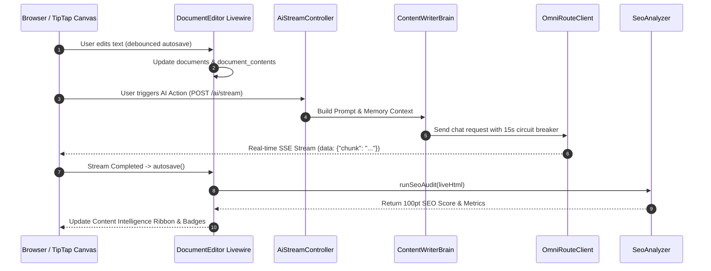

# 🧠 HOA-Studio: Neuro-Brain System Architecture Schema
<!--
|--------------------------------------------------------------------------
| HelpOfAi (HOA) Professional Software - System Architecture Schema
|--------------------------------------------------------------------------
|
| Copyright (c) 2026 Rajib Adhikary. All Rights Reserved.
| Author      : Rajib Adhikary
| Organization: HelpOfAi (HOA)
| Website     : https://helpofai.com
|--------------------------------------------------------------------------
-->

> [!IMPORTANT]
> **MANDATORY FOR ALL AI AGENTS**: Consult this neuro-brain schema **BEFORE** modifying, adding, or refactoring any code. This document maps every feature node, file path, synaptic data flow, and event bus so you can understand the complete codebase topology in seconds without re-reading thousands of files. Whenever you add or upgrade a feature, you **MUST update this schema**.

---

## 🧭 Neuro-Brain Architecture Map (Click Any Node to Jump to Its Synapse Spec)

```mermaid
flowchart TD
    %% Styling Classes (Neuro-Brain Glows)
    classDef cortex fill:#1e1b4b,stroke:#818cf8,stroke-width:2px,color:#e0e7ff;
    classDef frontal fill:#311042,stroke:#c084fc,stroke-width:2px,color:#f3e8ff;
    classDef parietal fill:#022c22,stroke:#34d399,stroke-width:2px,color:#ecfdf5;
    classDef occipital fill:#451a03,stroke:#fbbf24,stroke-width:2px,color:#fffbeb;
    classDef temporal fill:#172554,stroke:#60a5fa,stroke-width:2px,color:#eff6ff;
    classDef brainstem fill:#1f2937,stroke:#9ca3af,stroke-width:2px,color:#f9fafb;
    classDef external fill:#0f172a,stroke:#38bdf8,stroke-width:2px,stroke-dasharray: 5 5,color:#e2e8f0;

    subgraph BRAINSTEM ["🏛️ Central Brainstem (Governance, System & Updates)"]
        ADMIN["[Admin Control Center]"]:::brainstem
        AUTH["[Auth & Quotas Engine]"]:::brainstem
        UPDATER["[Core Update Engine]"]:::brainstem
        RESCUE["[Emergency Rescue Engine]"]:::brainstem
    end

    subgraph FRONTAL_LOBE ["⚡ Frontal Lobe (AI Reasoning & Generation Matrix)"]
        OMNIRoute["[OmniRoute Gateway Client]"]:::frontal
        WRITER_BRAIN["[Content Writer Brain & 15-Stage Pipeline]"]:::frontal
        STREAM_CTRL["[SSE Streaming Controller (/ai/stream)]"]:::frontal
        CIRCUIT_BREAKER["[AI Circuit Breaker & Rate Limiter]"]:::frontal
    end

    subgraph CEREBRAL_CORTEX ["📝 Cerebral Cortex (Central Canvas & Editor Engine)"]
        DOC_EDITOR["[DocumentEditor Livewire Core]"]:::cortex
        TIPTAP_CANVAS["[TipTap ProseMirror Canvas]"]:::cortex
        TOOLBAR_INTEL["[Editor Toolbar & Intelligence Tabs]"]:::cortex
        BRAIN_TAB["[🧠 TipTap Brain & Lineage Tab]"]:::cortex
        IN_CANVAS_REPAIR["[In-Canvas Micro-Repair & Slash Actions]"]:::cortex
        VERSION_SYS["[Version History & Snapshot Engine]"]:::cortex
        UNIVERSAL_IMPORT["[Universal Document Import Studio]"]:::cortex
    end

    subgraph PARIETAL_LOBE ["🎯 Parietal Lobe (SEO, Analytics & Perception)"]
        SEO_ANALYZER["[Rank Math SEO Engine & Heatmap]"]:::parietal
        SCHEMA_GEN["[JSON-LD Schema Generator]"]:::parietal
        QUALITY_AUDIT["[10-Point Quality Auditor]"]:::parietal
    end

    subgraph OCCIPITAL_LOBE ["📚 Occipital Lobe (Long-Term Memory & Knowledge)"]
        RAG_ENGINE["[KnowledgeBase RAG Retriever]"]:::occipital
        VECTOR_SEARCH["[Vector Semantic Search Engine]"]:::occipital
        BRAND_VOICE["[Brand Voice & Style Guide]"]:::occipital
    end

    subgraph TEMPORAL_LOBE ["🚀 Temporal Lobe (Publishing, Syndication & Delivery)"]
        BLOG_PUBLISH["[Public Blog Manager & Engine]"]:::temporal
        WP_BRIDGE["[Headless WordPress Sync Bridge]"]:::temporal
        DOC_SHARE["[Public Document Sharing & Access]"]:::temporal
    end

    subgraph EXTERNAL_NETWORKS ["🌐 External Synapses & Endpoints"]
        AI_PROVIDERS["(OpenAI / Claude / DeepSeek / Ollama)"]:::external
        WP_SITE["(Live WordPress Client Website)"]:::external
        PUBLIC_WEB["(Public Readers & Search Engines)"]:::external
    end

    %% Synaptic Interconnections
    DOC_EDITOR -- "1. Dispatch AI Prompt / Stage" --> STREAM_CTRL
    STREAM_CTRL -- "2. Assemble Memory & Context" --> WRITER_BRAIN
    WRITER_BRAIN -- "3. Query Relevant Embeddings" --> RAG_ENGINE
    RAG_ENGINE -- "Vector Match" --> VECTOR_SEARCH
    WRITER_BRAIN -- "Enforce Voice & Tone" --> BRAND_VOICE
    WRITER_BRAIN -- "4. Execute HTTP Dispatch" --> OMNIRoute
    OMNIRoute -- "Quota Check & Consume" --> AUTH
    OMNIRoute -- "Failover & Timeout Guard" --> CIRCUIT_BREAKER
    OMNIRoute -- "API Call" --> AI_PROVIDERS
    AI_PROVIDERS -- "Streaming Chunks" --> OMNIRoute
    OMNIRoute -- "SSE Format: data: chunk" --> STREAM_CTRL
    STREAM_CTRL -- "Real-time SSE Stream" --> TIPTAP_CANVAS

    DOC_EDITOR -- "Trigger SEO / Heatmap" --> SEO_ANALYZER
    SEO_ANALYZER -- "Marked HTML & 100pt Metrics" --> DOC_EDITOR
    SEO_ANALYZER -- "Generate Structured Data" --> SCHEMA_GEN
    SEO_ANALYZER -- "Audit Criteria Check" --> QUALITY_AUDIT

    DOC_EDITOR -- "Save Snapshot" --> VERSION_SYS
    DOC_EDITOR -- "File Ingestion & Parsing" --> UNIVERSAL_IMPORT
    UNIVERSAL_IMPORT -- "editor:insertImportedContent" --> TIPTAP_CANVAS
    DOC_EDITOR -- "One-Click Publish" --> BLOG_PUBLISH
    BLOG_PUBLISH -- "Render Public Article" --> PUBLIC_WEB
    DOC_EDITOR -- "Generate Secret Link" --> DOC_SHARE
    DOC_SHARE -- "Public Access" --> PUBLIC_WEB

    DOC_EDITOR -- "Remote Headless Sync" --> WP_BRIDGE
    WP_BRIDGE -- "REST API Handshake" --> WP_SITE

    ADMIN -- "Sync Models & Providers" --> OMNIRoute
    ADMIN -- "Run Database Updates" --> UPDATER
    UPDATER -- "Offline Failover" --> RESCUE

    %% Clickable Hyperlinks to Synapse Cards
    click DOC_EDITOR href "#1-documenteditor-livewire-core-cerebral-cortex" "Jump to DocumentEditor Synapse Spec"
    click TIPTAP_CANVAS href "#1-documenteditor-livewire-core-cerebral-cortex" "Jump to TipTap Canvas Spec"
    click UNIVERSAL_IMPORT href "#11-universal-document-import-studio-cerebral-cortex" "Jump to Universal Import Spec"
    click OMNIRoute href "#2-ai-intelligence--omniroute-gateway-frontal-lobe" "Jump to OmniRoute Gateway Spec"
    click WRITER_BRAIN href "#2-ai-intelligence--omniroute-gateway-frontal-lobe" "Jump to Content Writer Brain Spec"
    click STREAM_CTRL href "#2-ai-intelligence--omniroute-gateway-frontal-lobe" "Jump to SSE Controller Spec"
    click SEO_ANALYZER href "#3-rank-math-seo-analyzer--heatmap-parietal-lobe" "Jump to SEO Analyzer Spec"
    click RAG_ENGINE href "#4-knowledgebase-rag--vector-memory-occipital-lobe" "Jump to KnowledgeBase RAG Spec"
    click BRAND_VOICE href "#5-brand-voice--persona-engine" "Jump to Brand Voice Spec"
    click BLOG_PUBLISH href "#6-public-blog-manager--publishing-temporal-lobe" "Jump to Blog Publishing Spec"
    click WP_BRIDGE href "#7-wordpress-headless-bridge-system" "Jump to WordPress Bridge Spec"
    click ADMIN href "#8-admin-control-center-governance--brainstem" "Jump to Admin Control Center Spec"
    click AUTH href "#9-auth-quotas--security-matrix" "Jump to Auth & Quotas Spec"
    click UPDATER href "#10-core-updater--database-rollback-engine" "Jump to Core Updater Spec"
```

---

## ⚡ Master Synapse Quick-Jump Matrix

| Neural Hub | Feature Module | Core Entrypoint File | Primary Inbound Connection | Primary Outbound Connection |
| :--- | :--- | :--- | :--- | :--- |
| **Cortex** | [Document Editor](#1-documenteditor-livewire-core-cerebral-cortex) | [`DocumentEditor.php`](file:///C:/Users/rajib/Desktop/HOA-Studio/app/Features/Documents/Livewire/DocumentEditor.php) | Web Router (`/documents/{id}/edit`) | TipTap Canvas, SEO Engine, Blog, AI Stream |
| **Cortex** | [Universal Document Import Studio](#11-universal-document-import-studio-cerebral-cortex) | [`UniversalDocumentExtractor.php`](file:///C:/Users/rajib/Desktop/HOA-Studio/app/Features/Documents/Services/UniversalDocumentExtractor.php) | Toolbar Import Modal, File Uploads (`.docx`, `.pdf`, `.md`, `.html`, `.csv`, `.txt`, `.json`) | TipTap Canvas Insertion (`replace`, `append`, `cursor`, `new_doc`), Content Intelligence Analytics |
| **Frontal** | [OmniRoute AI Gateway](#2-ai-intelligence--omniroute-gateway-frontal-lobe) | [`OmniRouteClient.php`](file:///C:/Users/rajib/Desktop/HOA-Studio/app/Features/AI/Services/OmniRouteClient.php) | AI Stream Controller, Admin Settings | External AI Providers (OpenAI, Claude, DeepSeek) |
| **Frontal** | [Writer Brain & Pipeline](#2-ai-intelligence--omniroute-gateway-frontal-lobe) | [`ContentWriterBrain.php`](file:///C:/Users/rajib/Desktop/HOA-Studio/app/Features/AI/Services/ContentWriterBrain.php) | Stream Controller, Livewire Canvas | OmniRoute Gateway, RAG Knowledge, Brand Voice |
| **Parietal** | [Rank Math SEO Engine](#3-rank-math-seo-analyzer--heatmap-parietal-lobe) | [`SeoAnalyzer.php`](file:///C:/Users/rajib/Desktop/HOA-Studio/app/Features/SEO/Services/SeoAnalyzer.php) | DocumentEditor (`runSeoAudit`) | In-Canvas Color Heatmap, Schema Generator |
| **Occipital**| [RAG & Vector Memory](#4-knowledgebase-rag--vector-memory-occipital-lobe) | [`RetrieveRagContext.php`](file:///C:/Users/rajib/Desktop/HOA-Studio/app/Features/KnowledgeBase/Actions/RetrieveRagContext.php) | ContentWriterBrain, DocumentEditor | Vector Embedding Cache, AI Prompt Context |
| **Occipital**| [Brand Voice Engine](#5-brand-voice--persona-engine) | `BrandVoice` Module | ContentWriterBrain | Custom Persona & Tone Injections |
| **Temporal** | [Blog Publishing System](#6-public-blog-manager--publishing-temporal-lobe) | [`PublishDocumentToBlog.php`](file:///C:/Users/rajib/Desktop/HOA-Studio/app/Features/Blog/Actions/PublishDocumentToBlog.php) | DocumentEditor (`publishToBlog`) | Public Blog Router (`/blog/{slug}`), Search Engines |
| **Temporal** | [WordPress Headless Bridge](#7-wordpress-headless-bridge-system) | [`WordPressBridgeController.php`](file:///C:/Users/rajib/Desktop/HOA-Studio/app/Features/WordPress/Http/Controllers/WordPressBridgeController.php) | Remote WP Plugin REST API | DocumentContent, WordPress Editor Bundle |
| **Brainstem**| [Admin Control & Governance](#8-admin-control-center-governance--brainstem) | [`AdminDashboardPage.php`](file:///C:/Users/rajib/Desktop/HOA-Studio/app/Features/Admin/Livewire/AdminDashboardPage.php) | `/admin` Routes (Admin Role Only) | System Settings, User Quotas, OmniRoute Setup |
| **Brainstem**| [Auth & Quota Matrix](#9-auth-quotas--security-matrix) | [`User.php`](file:///C:/Users/rajib/Desktop/HOA-Studio/app/Models/User.php) | Login, AI Streams, Document Saves | Quota Deduction (`consumeQuota`), Role Gateways |
| **Brainstem**| [Core Updater & Rollback](#10-core-updater--database-rollback-engine) | [`CoreUpdateService.php`](file:///C:/Users/rajib/Desktop/HOA-Studio/app/Features/Admin/Services/CoreUpdateService.php) | Admin Updates Page, GitHub Webhook | `.env` Sync, Database Migrations, Version File |
| **Frontal**  | [Content Intelligence OS](#13-content-intelligence-os--dynamic-workflow-graph-frontal-lobe--cognitive-brain) | [`ContentIntelligencePage.php`](file:///C:/Users/rajib/Desktop/HOA-Studio/app/Features/ContentIntelligence/Livewire/ContentIntelligencePage.php) | Web Router (`/dashboard/content-intelligence`), Sidebar Navigation | Dynamic Workflow Graph, Structured Stage DTOs, TipTap AST |

---

## 🧬 Deep Synaptic Specification Cards

---

### 1. DocumentEditor Livewire Core (Cerebral Cortex)
* **Primary Role**: The command cockpit of HOA-Studio. Manages canvas state, TipTap synchronizations, auto-saving, snapshots, modal popups, and tabs.
* **Core Files**:
  - Livewire Component: [`DocumentEditor.php`](file:///C:/Users/rajib/Desktop/HOA-Studio/app/Features/Documents/Livewire/DocumentEditor.php)
  - Master View: [`editor.blade.php`](file:///C:/Users/rajib/Desktop/HOA-Studio/resources/views/documents/editor.blade.php)
  - Canvas Partial: [`canvas.blade.php`](file:///C:/Users/rajib/Desktop/HOA-Studio/resources/views/editor/partial/canvas.blade.php)
  - Toolbar Partial: [`toolbar.blade.php`](file:///C:/Users/rajib/Desktop/HOA-Studio/resources/views/editor/partial/toolbar.blade.php)
  - Modals Partial: [`modals.blade.php`](file:///C:/Users/rajib/Desktop/HOA-Studio/resources/views/editor/partial/modals.blade.php)
  - Intelligence Tabs & Partials:
    - [`content-intelligence.blade.php`](file:///C:/Users/rajib/Desktop/HOA-Studio/resources/views/editor/partial/content-intelligence.blade.php)
    - [`content-intelligence-tab-post.blade.php`](file:///C:/Users/rajib/Desktop/HOA-Studio/resources/views/editor/partial/Components/content-intelligence-tab-post.blade.php)
    - [`content-intelligence-tab-seo.blade.php`](file:///C:/Users/rajib/Desktop/HOA-Studio/resources/views/editor/partial/Components/content-intelligence-tab-seo.blade.php)
    - [`content-intelligence-tab-titles-meta.blade.php`](file:///C:/Users/rajib/Desktop/HOA-Studio/resources/views/editor/partial/Components/content-intelligence-tab-titles-meta.blade.php)
    - [`content-intelligence-tab-ai-ideas.blade.php`](file:///C:/Users/rajib/Desktop/HOA-Studio/resources/views/editor/partial/Components/content-intelligence-tab-ai-ideas.blade.php)
    - [`content-intelligence-tab-keywords.blade.php`](file:///C:/Users/rajib/Desktop/HOA-Studio/resources/views/editor/partial/Components/content-intelligence-tab-keywords.blade.php)
    - [`content-intelligence-tab-quality.blade.php`](file:///C:/Users/rajib/Desktop/HOA-Studio/resources/views/editor/partial/Components/content-intelligence-tab-quality.blade.php)
    - [`content-intelligence-tab-outline.blade.php`](file:///C:/Users/rajib/Desktop/HOA-Studio/resources/views/editor/partial/Components/content-intelligence-tab-outline.blade.php)
    - [`content-intelligence-tab-versions.blade.php`](file:///C:/Users/rajib/Desktop/HOA-Studio/resources/views/editor/partial/Components/content-intelligence-tab-versions.blade.php)
  - Intelligence Scripts: [`scripts-ai.blade.php`](file:///C:/Users/rajib/Desktop/HOA-Studio/resources/views/editor/partial/scripts-ai.blade.php)
  - Canvas Scripts: [`scripts-canvas.blade.php`](file:///C:/Users/rajib/Desktop/HOA-Studio/resources/views/editor/partial/scripts-canvas.blade.php)
* **Inbound Synapses**:
  - Web Route `GET /documents/{id}/edit`
  - Alpine.js events (`content:changed`, `tiptap:save`, `seo:locate`)
* **Outbound Synapses**:
  - Dispatches to SSE Controller `POST /ai/stream` (Prompt generation)
  - Calls [`SeoAnalyzer.php`](file:///C:/Users/rajib/Desktop/HOA-Studio/app/Features/SEO/Services/SeoAnalyzer.php) via `runSeoAudit(liveHtml)`
  - Calls [`PublishDocumentToBlog.php`](file:///C:/Users/rajib/Desktop/HOA-Studio/app/Features/Blog/Actions/PublishDocumentToBlog.php) via `publishToBlog()`
  - Calls [`CreateDocumentShare.php`](file:///C:/Users/rajib/Desktop/HOA-Studio/app/Features/Documents/Actions/CreateDocumentShare.php) via `createOrUpdateShare()`
* **Internal Mechanics**:
  - Debounced autosave (3 seconds) writes to `documents` and `document_contents` tables.
  - Clamps titles to 190 characters to respect MySQL `VARCHAR(191)` constraints.
  - Heatmap is rendered in an isolated browser overlay `#seo-heatmap-overlay` in `canvas.blade.php`, never mutating ProseMirror state.
  - **Instant 0ms Modal & Tab Decoupling**: Toolbar modal triggers (`showImportModalLocal`, `showShareModalLocal`, `showBlogModalLocal`, `showSeoDrawerLocal`) and modal internal tabs (Import Canvas Preview vs Analysis vs Raw Text) switch in 0ms directly via client-side Alpine.js without waiting for blocking Livewire server roundtrips.
  - **Optimistic Tag & Keyword Chips (0ms UI Addition)**: Secondary keywords and post tags update the UI instantly (0ms) through reactive Alpine state with `$watch` synchronization to Livewire properties in the background, eliminating click latency when adding or toggling tags.
  - **Global `wire:key` DOM Morphing Protection**: Every dynamic loop across the editor (Post Categories, Popular Tags, Secondary Keywords, AI Entities, SERP FAQ Previews, Titles, Meta Descriptions, Content Gaps, FAQs, and Version History) enforces explicit, deterministic `wire:key` attributes, preventing Livewire 3 DOM tree corruption, misaligned morphs, and button click delays.
  - **Blade vs Alpine Syntax Conflict Elimination**: Replaced problematic `@entangle` directives inside partial views with `$wire.entangle()` and removed duplicate `.live` entanglements from controls already bound via event handlers, preventing duplicate HTTP requests on UI interactions.
  - **Memory & Serialization Safeguards**: Strip heavy AST HTML from persistent state (`seoData.marked_html`). Historical version records are queried with lightweight metadata columns (`['id', 'document_id', 'created_by', 'version_number', 'word_count', 'summary', 'operation_type', 'created_at']`). Deep version content is retrieved strictly on-demand via `getVersionContent(id)` for diffing, saving megabytes per autosave cycle.
  - **Instant Button Feedback Engine**: All action buttons across toolbar and Content Intelligence tabs (SEO, Versions, Keywords, Post/Publish, AI Ideas, Titles & Meta) enforce `wire:loading.attr="disabled"`, visual spinners, and state disabling, completely preventing duplicate requests and click lag.
  - **Multi-Format Drag-and-Drop Featured Image Upload Engine with Live Progress & Dual-Preview Sync**: Integrated native file uploads via `WithFileUploads` in [`DocumentEditor.php`](file:///C:/Users/rajib/Desktop/HOA-Studio/app/Features/Documents/Livewire/DocumentEditor.php) (`$featuredImageUpload`, `updatedFeaturedImageUpload()`). Supports multi-format assets (`png, jpg, jpeg, webp, gif, svg, avif, bmp, ico, tif, tiff`) up to 15MB with automatic public storage linking (`featured-images/`). Features client-side animated upload progress bars (`livewire-upload-progress`, `0% → 100%`) directly inside the dropzone container, in-place instant image previewing with 1-click replacement overlays, and synchronized previews across both the Post Settings sidebar and the Publish Article to Blog modal (`class="w-full h-36 object-cover"`).
  - **SEO-Optimized Semantic Image Filenames & Public Storage Fallback**: Uploaded featured images automatically generate Google-friendly, keyword-rich filenames via `generateSeoFriendlyImageName()` (e.g. `{article-slug}-featured-image-{hash6}.{ext}`) instead of raw random hashes. Paired with a dedicated public storage fallback route (`/storage/{path}`) in [`routes/web.php`](file:///C:/Users/rajib/Desktop/HOA-Studio/routes/web.php), completely preventing 403 Forbidden errors across Windows and shared hosting/cPanel environments without symlink privileges.
  - **Single-Root DOM Integrity**: Strictly preserves Livewire 3 single root container rule across `editor.blade.php` and partials (`modals.blade.php`), preventing DOM morphing desyncs and premature container closure.
* **Failure Guardrail**: Never remove public methods bound to `wire:click` (e.g. `toggleSeoDrawer`, `runSeoAudit`, `openBlogModal`). Ensure single root `
` in `editor.blade.php`.

---

### 2. AI Intelligence & OmniRoute Gateway (Frontal Lobe)
* **Primary Role**: Unified AI routing engine supporting cloud LLMs (OpenAI, Claude, DeepSeek, Groq, Gemini) and local models (Ollama, LM Studio).
* **Core Files**:
  - Master Client: [`OmniRouteClient.php`](file:///C:/Users/rajib/Desktop/HOA-Studio/app/Features/AI/Services/OmniRouteClient.php)
  - Streaming Controller: [`AiStreamController.php`](file:///C:/Users/rajib/Desktop/HOA-Studio/app/Features/AI/Http/Controllers/AiStreamController.php)
  - Brain & Prompt Matrix: [`ContentWriterBrain.php`](file:///C:/Users/rajib/Desktop/HOA-Studio/app/Features/AI/Services/ContentWriterBrain.php)
  - Pipeline Orchestrator: [`PipelineCoordinator.php`](file:///C:/Users/rajib/Desktop/HOA-Studio/app/Features/AI/Services/PipelineCoordinator.php)
  - Circuit Breaker: [`AiCircuitBreaker.php`](file:///C:/Users/rajib/Desktop/HOA-Studio/app/Features/AI/Services/AiCircuitBreaker.php)
  - Config: [`config/omniroute.php`](file:///C:/Users/rajib/Desktop/HOA-Studio/config/omniroute.php)
* **Inbound Synapses**:
  - `POST /ai/stream` from editor canvas with payload `{ action, context, target_model, prompt }`
  - Direct pipeline execution calls from [`DocumentEditor.php`](file:///C:/Users/rajib/Desktop/HOA-Studio/app/Features/Documents/Livewire/DocumentEditor.php)
* **Outbound Synapses**:
  - Injects RAG chunks from [`RetrieveRagContext.php`](file:///C:/Users/rajib/Desktop/HOA-Studio/app/Features/KnowledgeBase/Actions/RetrieveRagContext.php)
  - Streams Server-Sent Events (SSE) `data: {"chunk": "...", "done": false}\n\n` back to browser TipTap client
  - Deducts user word balance via `$user->consumeQuota($words)`
* **Internal Mechanics**:
  - Applies 15-second strict circuit breaker timeouts on all HTTP requests to prevent web process starvation.
  - Failover system: If primary model fails, automatically routes to fallback provider.
* **Failure Guardrail**: Never bypass `$user->consumeQuota()`. Always return pure SSE formatted streams without markdown wrappers on stream boundaries.

---

### 3. Rank Math SEO Analyzer & Heatmap (Parietal Lobe)
* **Primary Role**: Real-time 100-point SEO scoring engine, LSI entity density matrix, and in-canvas color-coded heatmap.
* **Core Files**:
  - Analyzer: [`SeoAnalyzer.php`](file:///C:/Users/rajib/Desktop/HOA-Studio/app/Features/SEO/Services/SeoAnalyzer.php)
  - Schema Generator: [`SchemaGenerator.php`](file:///C:/Users/rajib/Desktop/HOA-Studio/app/Features/SEO/Services/SchemaGenerator.php)
  - Model: [`SeoAnalysis.php`](file:///C:/Users/rajib/Desktop/HOA-Studio/app/Features/SEO/Models/SeoAnalysis.php)
  - SEO Tab View: [`content-intelligence-tab-seo.blade.php`](file:///C:/Users/rajib/Desktop/HOA-Studio/resources/views/editor/partial/Components/content-intelligence-tab-seo.blade.php)
* **Inbound Synapses**:
  - Live HTML from TipTap via `runSeoAudit(liveHtml)`
  - Keyword updates via `wire:model.lazy="targetKeyword"`
* **Outbound Synapses**:
  - Returns calculated score, check breakdown (Critical 🔴, Warning 🟡, AI/GEO 🟣, Authority 🔵, Passed 🟢), and `marked_html`.
  - Injects schema markup into Titles & Meta tab.
* **Internal Mechanics**:
  - Uses DOMDocument and Regex parsing to audit keyword density, header placement, image alts, URL slug length, and readability ease.
  - "Locate in Content" uses TipTap's `tiptap.view.posAtDOM(el, 0)` + `tiptap.commands.setTextSelection(pos)` to jump directly to the target paragraph without restoring old mouse click positions.
* **Failure Guardrail**: Never treat `<h1>` as a subheading (`h2, h3`). Keep `kw_in_intro` scoped strictly to paragraph 0.

---

### 4. KnowledgeBase RAG & Vector Memory (Occipital Lobe)
* **Primary Role**: Semantic memory bank. Stores external documentation, articles, and knowledge bases for RAG retrieval during AI generation.
* **Core Files**:
  - Retriever: [`RetrieveRagContext.php`](file:///C:/Users/rajib/Desktop/HOA-Studio/app/Features/KnowledgeBase/Actions/RetrieveRagContext.php)
  - Vector Engine: [`VectorSearchEngine.php`](file:///C:/Users/rajib/Desktop/HOA-Studio/app/Features/KnowledgeBase/Services/VectorSearchEngine.php)
  - Chunker: [`SemanticChunker.php`](file:///C:/Users/rajib/Desktop/HOA-Studio/app/Features/KnowledgeBase/Services/SemanticChunker.php)
  - Models: `KnowledgeSource`, `KnowledgeChunk`, `VectorEmbeddingCache`
  - UI Page: [`KnowledgeBasePage.php`](file:///C:/Users/rajib/Desktop/HOA-Studio/app/Features/KnowledgeBase/Livewire/KnowledgeBasePage.php)
* **Inbound Synapses**:
  - Knowledge uploads (PDF, TXT, URLs) from `/knowledge-base` UI.
* **Outbound Synapses**:
  - Automatically queries top-3 semantic chunks and injects them into [`ContentWriterBrain.php`](file:///C:/Users/rajib/Desktop/HOA-Studio/app/Features/AI/Services/ContentWriterBrain.php) prompt memory.
* **Failure Guardrail**: Respect chunk token limits (max 500 tokens per chunk) to avoid blowing LLM context windows.

---

### 5. Brand Voice & Persona Engine
* **Primary Role**: Enforces consistent brand tonality, vocabulary constraints, and target audience personas across all generated drafts.
* **Core Files**:
  - Service & Repository in `app/Features/BrandVoice/`
* **Inbound Synapses**:
  - Active brand voice selection from Editor toolbar.
* **Outbound Synapses**:
  - Prepended into system instructions in [`ContentWriterBrain.php`](file:///C:/Users/rajib/Desktop/HOA-Studio/app/Features/AI/Services/ContentWriterBrain.php).

---

### 6. Public Blog Manager & Publishing (Temporal Lobe)
* **Primary Role**: One-click publishing pipeline that turns private workspace documents into SEO-optimized public blog posts.
* **Core Files**:
  - Publisher Action: [`PublishDocumentToBlog.php`](file:///C:/Users/rajib/Desktop/HOA-Studio/app/Features/Blog/Actions/PublishDocumentToBlog.php)
  - Unpublisher Action: [`UnpublishDocumentFromBlog.php`](file:///C:/Users/rajib/Desktop/HOA-Studio/app/Features/Blog/Actions/UnpublishDocumentFromBlog.php)
  - Model: [`BlogPost.php`](file:///C:/Users/rajib/Desktop/HOA-Studio/app/Features/Blog/Models/BlogPost.php)
  - Livewire UI: [`BlogIndexPage.php`](file:///C:/Users/rajib/Desktop/HOA-Studio/app/Features/Blog/Livewire/BlogIndexPage.php), [`BlogManagerPage.php`](file:///C:/Users/rajib/Desktop/HOA-Studio/app/Features/Blog/Livewire/BlogManagerPage.php), [`BlogPostPage.php`](file:///C:/Users/rajib/Desktop/HOA-Studio/app/Features/Blog/Livewire/BlogPostPage.php)
  - Public Show View: [`show.blade.php`](file:///C:/Users/rajib/Desktop/HOA-Studio/resources/views/blog/show.blade.php)
  - Public Archive View: [`index.blade.php`](file:///C:/Users/rajib/Desktop/HOA-Studio/resources/views/blog/index.blade.php)
  - Typography Stylesheet: [`markdown.css`](file:///C:/Users/rajib/Desktop/HOA-Studio/resources/css/markdown.css)
  - Tab UI: [`content-intelligence-tab-post.blade.php`](file:///C:/Users/rajib/Desktop/HOA-Studio/resources/views/editor/partial/Components/content-intelligence-tab-post.blade.php)
* **Inbound Synapses**:
  - Triggered via `publishToBlog()` in [`DocumentEditor.php`](file:///C:/Users/rajib/Desktop/HOA-Studio/app/Features/Documents/Livewire/DocumentEditor.php).
* **Outbound Synapses**:
  - Public routes: `GET /blog`, `GET /blog/archive`, and `GET /blog/{slug}`
* **Internal Mechanics**:
  - Generates unique slug using `BlogPost::generateUniqueSlug()`.
  - Maintains link between `document_id` and `blog_posts.id` for instant sync updates.
  - **Dynamic Knowledge Archive & Content Explorer (`BlogIndexPage.php`, `index.blade.php`)**:
    - **Live Debounced Search**: Multi-field querying across title, excerpt, category, tags, and content.
    - **Dynamic Tag Cloud**: Automated frequency indexing (`BlogPost::getPublishedTagsWithCounts()`), interactive tag pills, and URL query synchronization (`?tag=...`).
    - **Categories Directory**: Horizontal pill carousel and vertical sidebar deck with live article counts.
    - **Archive Timeline**: Chronological Year/Month breakdown (`BlogPost::getPublishedArchiveTimeline()`) with one-click period scoping (`?archive=YYYY-mm`).
    - **Read-Time Filters & Multi-Criteria Sorting**: Quick reads (< 5 min), deep dives (5+ min), and sorting by newest, views (popularity), oldest, read duration, or alphabetical.
    - **Dual Presentation Views**: One-click switcher between Magazine Grid (`▦`) and Editorial List (`☰`) layouts.
    - **Active Filter Chips Bar**: Visual dismissible chips for each active filter criteria with single-click reset.
  - Public article content rendered with `.hoa-article-content` and `.markdown-body` via [`markdown.css`](file:///C:/Users/rajib/Desktop/HOA-Studio/resources/css/markdown.css), providing dark glassmorphic styling for tables, checklists, callouts, and code blocks with automatic duplicate leading `<h1>` suppression.
  - **Zero-Latency Independent Post Sidebar Accordions & Multi-Format Featured Image Upload**: Status & Visibility, Multi-Format Featured Image Upload (PNG/JPG/WebP/GIF/SVG/AVIF/BMP/ICO/TIFF drag-and-drop dropzone with browse, replace, and instant preview), Categories, Tags, and Excerpt panels in [`content-intelligence-tab-post.blade.php`](file:///C:/Users/rajib/Desktop/HOA-Studio/resources/views/editor/partial/Components/content-intelligence-tab-post.blade.php) utilize self-contained Alpine components (`x-data="{ isOpen: ... }"`) keyed with `wire:key` to prevent Livewire morphing conflicts, deliver 0ms category selection, instant image dropzone uploads and preset previews, and real-time character counts without collapsing active panels.
  - **Publisher-Grade Editorial Layout**: Responsive 2-column magazine architecture (`lg:grid-cols-12`):
    - **Editorial Masthead**: Typographic hero with category kicker, reading time, view count, byline strip, and cinematic featured image banner.
    - **Dual Editorial Publication & Revision Dates**: Byline strip supports dual publication tracking, cleanly rendering `Published on {date}` alongside `Updated on {date}` whenever an article has been updated or revised post-publication, backed by atomic view counting (`DB::table()->increment('views_count')`) that preserves content modification timestamps.
    - **Dynamic Table of Contents (TOC)**: Alpine.js (`hoaBlogPostReader()`) auto-extracts `h2` and `h3` tags, generates semantic anchor IDs, applies `scroll-margin-top`, and tracks scroll position with active section highlight. Includes mobile collapsible drawer for screens `< lg`.
    - **Reading Immersion**: Fixed top scroll progress bar (`0% → 100%`) and a floating blurred glass header that slides in when scrolled past hero with real-time reading progress and quick-share actions.
    - **Circulation & Navigation**: Previous and Next article cards (`$previousPost`, `$nextPost`), verified author card with author post archive links, and related category stories deck.
    - **Tabbed Discovery Hub (Sticky Aside Rail)**: Alpine.js-powered 3-tab widget displaying:
      - `Similar`: Other published articles in the same category (`$similarPosts`).
      - `By Author`: Articles published by the same author (`$authorPosts`).
      - `Trending`: Most-read articles across the journal ranked `#01, #02...` (`$trendingPosts`).
    - **Code Snippets**: 1-click clipboard copy button on all `<pre>` code blocks with visual `"✓ Copied!"` feedback.
    - **Self-Hosted Visual Diagram & Schema Engine** ([`blog-visual-enhancer.js`](file:///C:/Users/rajib/Desktop/HOA-Studio/resources/js/features/blog/blog-visual-enhancer.js)):
      - **Embedded Markdown Auto-Unpacker**: Automatically detects and unpacks giant raw Markdown code blocks containing embedded headings (`##`), dividers (`---`), ASCII architecture diagrams, and Mermaid diagrams into separate semantic DOM elements (`<h2>`, `<pre>`, `
`), allowing dynamic TOC indexing.
      - **Interactive Pan & Zoom Canvas (ER Schemas & Diagrams)**: 100% self-hosted local Mermaid library bundled via Vite (0 CDN dependencies). Auto-detects `erDiagram`, `flowchart`, `sequenceDiagram`, etc., rendering them into an interactive dark-glass viewport with:
        - **Drag-to-Move Panning**: Click & drag with mouse cursor (`cursor: grab / grabbing`) or single-finger touch dragging on mobile devices.
        - **Smooth Wheel & Pinch Zoom**: Mouse wheel scroll-to-zoom with pointer focal tracking, and multi-touch pinch-to-zoom on touchscreens.
        - **Precision Zoom Controls**: `➕` Zoom In, `➖` Zoom Out, live percentage indicator (`100%`, `125%`, etc.), double-click detail toggle, and 1-click `⟲ Fit` canvas reset.
        - **Floating Quick Dock & Source Drawers**: In-canvas floating quick action buttons, toggleable Mermaid source-code drawers, and 1-click schema clipboard copying.
      - **Cyberpunk ASCII Architecture Terminals**: Box-drawing flowcharts (e.g. `┌─┐│└┘▼▲`) are auto-wrapped in a macOS terminal frame (`🔴 🟡 🟢`) with locked monospace font alignment and 1-click diagram copy.
      - **Permission & Feature Matrix Enhancer**: Tables comparing features/plans auto-highlight checkmarks (`✓` in glowing emerald), crossmarks (`✕` in muted slate), and pills (`⚡ ...`) with responsive horizontal scrollers.
    - **Client-Side Reading Memory & Multi-Card Progress Sync Engine (`hoaCardReadingProgress`)**:
      - **Persistent Reading Storage**: Automatically records and persists per-article reading progress (`progress`, `completed`, `scrollY`, `updated_at`) using browser `localStorage` keyed by unique article slug (`hoa_read_progress_{slug}`).
      - **Dynamic Reading Progress Bar & Status Metrics**: Article cards across Grid View, List View, and the Featured Hero Spotlight dynamically reveal an animated gradient progress track (`0% → 100%`) with real-time status badges (`• 35% read` or `✓ 100% Read`), calculated time remaining (`4m left`), and floating thumbnail status pills.
      - **Upgraded Glassmorphic Action Buttons**: Replaced generic text links with high-end, rounded-xl glassmorphic action buttons featuring 3 reactive dynamic states:
        - *Unread*: "Read →" with subtle hover arrow translation and indigo border glow.
        - *In Progress*: "Resume (35%) →" with active indigo gradient glow and direct jump option.
        - *Completed*: "Read Again ↺" with emerald glass styling and smooth 180° rotation on hover.
      - **Zero-Latency bfcache & Multi-Tab Synchronization**: Automatically listens for window `storage`, `pageshow`, and `focus` events, ensuring instant updates when navigating back from an article without requiring a full page reload.
      - **Pick-Up Where You Left Off (Floating Resume Toast)**: In `/blog/{slug}`, if a reader previously read past 350px without completing the article, a non-intrusive floating toast appears with a 1-click `Jump →` action to smoothly glide down to their exact saved reading point.

---

### 7. WordPress Headless Bridge & Enterprise Plugin Suite
* **Primary Role**: Full-featured enterprise content production workspace for WordPress. Connects WP-Admin with TipTap 3.30, OmniRoute AI SSE streaming, live word/token speed telemetry, 2-way cloud document synchronization, automatic SEO meta generation, and Gutenberg AI sidebar assistance.
* **Core Files**:
  - Backend Controller: [`WordPressBridgeController.php`](file:///C:/Users/rajib/Desktop/HOA-Studio/app/Features/WordPress/Http/Controllers/WordPressBridgeController.php)
  - Handshake Verifier: [`VerifyWordPressHandshake.php`](file:///C:/Users/rajib/Desktop/HOA-Studio/app/Features/WordPress/Actions/VerifyWordPressHandshake.php)
  - Distribution Packaging Service: [`WordPressPluginService.php`](file:///C:/Users/rajib/Desktop/HOA-Studio/app/Features/WordPress/Services/WordPressPluginService.php)
  - Studio Token Manager: [`UserStudioToken.php`](file:///C:/Users/rajib/Desktop/HOA-Studio/app/Features/Auth/Models/UserStudioToken.php)
  - Plugin Main Bootstrap: [`hoa-studio-wordpress.php`](file:///C:/Users/rajib/Desktop/HOA-Studio/public/plugins/hoa-studio-wordpress/hoa-studio-wordpress.php)
  - Plugin Core Modules:
    - Orchestrator: [`class-hoa-plugin.php`](file:///C:/Users/rajib/Desktop/HOA-Studio/public/plugins/hoa-studio-wordpress/includes/Core/class-hoa-plugin.php)
    - Activator & Deactivator: [`class-hoa-activator.php`](file:///C:/Users/rajib/Desktop/HOA-Studio/public/plugins/hoa-studio-wordpress/includes/Core/class-hoa-activator.php), [`class-hoa-deactivator.php`](file:///C:/Users/rajib/Desktop/HOA-Studio/public/plugins/hoa-studio-wordpress/includes/Core/class-hoa-deactivator.php)
    - Settings Manager: [`class-hoa-settings.php`](file:///C:/Users/rajib/Desktop/HOA-Studio/public/plugins/hoa-studio-wordpress/includes/Core/class-hoa-settings.php)
    - Admin Controller: [`class-hoa-admin.php`](file:///C:/Users/rajib/Desktop/HOA-Studio/public/plugins/hoa-studio-wordpress/includes/Admin/class-hoa-admin.php)
    - Metabox Controller: [`class-hoa-metabox.php`](file:///C:/Users/rajib/Desktop/HOA-Studio/public/plugins/hoa-studio-wordpress/includes/Admin/class-hoa-metabox.php)
    - SEO Generator & Auditor: [`class-hoa-seo-generator.php`](file:///C:/Users/rajib/Desktop/HOA-Studio/public/plugins/hoa-studio-wordpress/includes/Admin/class-hoa-seo-generator.php)
    - Fullscreen TipTap Studio Editor: [`class-hoa-studio-editor.php`](file:///C:/Users/rajib/Desktop/HOA-Studio/public/plugins/hoa-studio-wordpress/includes/Editor/class-hoa-studio-editor.php)
    - Gutenberg Block Suite: [`class-hoa-gutenberg-blocks.php`](file:///C:/Users/rajib/Desktop/HOA-Studio/public/plugins/hoa-studio-wordpress/includes/Gutenberg/class-hoa-gutenberg-blocks.php)
    - AJAX Handshake & SSE Stream Proxy: [`class-hoa-ajax-handler.php`](file:///C:/Users/rajib/Desktop/HOA-Studio/public/plugins/hoa-studio-wordpress/includes/Api/class-hoa-ajax-handler.php)
    - REST API Inbound Sync & Inventory: [`class-hoa-rest-api.php`](file:///C:/Users/rajib/Desktop/HOA-Studio/public/plugins/hoa-studio-wordpress/includes/Api/class-hoa-rest-api.php)
    - 2-Way Cloud Synchronizer: [`class-hoa-cloud-sync.php`](file:///C:/Users/rajib/Desktop/HOA-Studio/public/plugins/hoa-studio-wordpress/includes/Sync/class-hoa-cloud-sync.php)
  - Plugin Views:
    - [`admin-dashboard.php`](file:///C:/Users/rajib/Desktop/HOA-Studio/public/plugins/hoa-studio-wordpress/views/admin-dashboard.php), [`admin-connection.php`](file:///C:/Users/rajib/Desktop/HOA-Studio/public/plugins/hoa-studio-wordpress/views/admin-connection.php), [`admin-ai-settings.php`](file:///C:/Users/rajib/Desktop/HOA-Studio/public/plugins/hoa-studio-wordpress/views/admin-ai-settings.php), [`admin-editor-settings.php`](file:///C:/Users/rajib/Desktop/HOA-Studio/public/plugins/hoa-studio-wordpress/views/admin-editor-settings.php), [`metabox-post-sidebar.php`](file:///C:/Users/rajib/Desktop/HOA-Studio/public/plugins/hoa-studio-wordpress/views/metabox-post-sidebar.php), [`studio-canvas.php`](file:///C:/Users/rajib/Desktop/HOA-Studio/public/plugins/hoa-studio-wordpress/views/studio-canvas.php)
  - Assets & Bundles:
    - CSS: [`hoa-studio.css`](file:///C:/Users/rajib/Desktop/HOA-Studio/public/plugins/hoa-studio-wordpress/assets/css/hoa-studio.css), [`hoa-editor.css`](file:///C:/Users/rajib/Desktop/HOA-Studio/public/plugins/hoa-studio-wordpress/assets/css/hoa-editor.css)
    - JS: [`hoa-admin.js`](file:///C:/Users/rajib/Desktop/HOA-Studio/public/plugins/hoa-studio-wordpress/assets/js/hoa-admin.js), [`hoa-gutenberg.js`](file:///C:/Users/rajib/Desktop/HOA-Studio/public/plugins/hoa-studio-wordpress/assets/js/hoa-gutenberg.js), [`hoa-tiptap-bundle.js`](file:///C:/Users/rajib/Desktop/HOA-Studio/public/plugins/hoa-studio-wordpress/assets/js/hoa-tiptap-bundle.js) (compiled from `resources/js/plugins/wordpress-editor.js`)
* **Inbound Synapses**:
  - `POST /api/v1/wordpress/connect`: Token handshake verification and telemetry discovery.
  - `POST /api/v1/wordpress/stream`: Real-time SSE streaming for text generation, rewrites, and tone adjustments.
  - `POST /api/v1/wordpress/transform`: Synchronous AI transformations.
  - `POST /api/v1/wordpress/sync-document`: Bidirectional article sync.
  - `GET /dashboard/wordpress/plugin/download`: Dynamic packaging and download of the distribution ZIP.
* **Outbound Synapses**:
  - WordPress REST endpoint `/wp-json/hoa-studio/v1/sync` for inbound draft webhooks from HOA-Studio cloud.
  - Proxy dispatches directly to [`OmniRouteClient.php`](file:///C:/Users/rajib/Desktop/HOA-Studio/app/Features/AI/Services/OmniRouteClient.php) with Bearer token authentication and quota deduction.

---

### 8. Admin Control Center & Governance (Brainstem)
* **Primary Role**: System administration, global model governance, user management, and updates.
* **Core Files**:
  - Dashboard: [`AdminDashboardPage.php`](file:///C:/Users/rajib/Desktop/HOA-Studio/app/Features/Admin/Livewire/AdminDashboardPage.php)
  - OmniRoute Control: [`AdminOmniRouteSetupPage.php`](file:///C:/Users/rajib/Desktop/HOA-Studio/app/Features/Admin/Livewire/AdminOmniRouteSetupPage.php)
  - AI Settings: [`AdminAiSettingsPage.php`](file:///C:/Users/rajib/Desktop/HOA-Studio/app/Features/Admin/Livewire/AdminAiSettingsPage.php)
  - Users Management: [`AdminUsersPage.php`](file:///C:/Users/rajib/Desktop/HOA-Studio/app/Features/Admin/Livewire/AdminUsersPage.php)
* **Inbound Synapses**:
  - Admin-only routes behind `role:admin` middleware.
* **Outbound Synapses**:
  - Controls active flags on `ai_models` and `ai_providers` tables.

---

### 9. Auth, Quotas & Security Matrix
* **Primary Role**: User authentication, API token authorization, security headers, and word quota enforcement.
* **Core Files**:
  - Model: [`User.php`](file:///C:/Users/rajib/Desktop/HOA-Studio/app/Models/User.php)
  - Middleware: [`SecurityHeadersMiddleware.php`](file:///C:/Users/rajib/Desktop/HOA-Studio/app/Http/Middleware/SecurityHeadersMiddleware.php)
  - Logs: `AuthSecurityLog`, `BlockedIp`
* **Inbound Synapses**:
  - All incoming web and API requests.
* **Outbound Synapses**:
  - Grants or rejects AI generation requests via `$user->hasQuota($words)`.

---

### 10. Core Updater & Database Rollback Engine
* **Primary Role**: Automated system updates, GitHub release tracking, environment variable merging, and schema migration rollbacks.
* **Core Files**:
  - Update Service: [`CoreUpdateService.php`](file:///C:/Users/rajib/Desktop/HOA-Studio/app/Features/Admin/Services/CoreUpdateService.php)
  - Rollback Service: [`DatabaseUpdateRollbackService.php`](file:///C:/Users/rajib/Desktop/HOA-Studio/app/Features/Admin/Services/DatabaseUpdateRollbackService.php)
  - Standalone Rescue: [`hoa-rescue.php`](file:///C:/Users/rajib/Desktop/HOA-Studio/public/hoa-rescue.php)
  - Version Spec: [`version.json`](file:///C:/Users/rajib/Desktop/HOA-Studio/version.json)
* **Inbound Synapses**:
  - Admin UI updates trigger or GitHub release webhooks.
* **Outbound Synapses**:
  - Safely syncs `.env.example` into `.env` without overwriting production credentials.
  - Executes defensive database migrations.
* **Internal Mechanics**:
  - Automatically verifies target version compatibility before applying updates.
  - Generates atomic pre-update code backups in `storage/app/backups/`.
  - In testing environments (`app()->environment('testing')`), uses an optimized lightweight mock snapshot to prevent memory exhaustion and preserve sub-second test execution speeds.

---

### 11. Universal Document Import Studio (Cerebral Cortex)
* **Primary Role**: Advanced multi-format document parser, intelligent content extractor, and real-time text intelligence engine. Extracts formatted typography, headings, lists, and tables while computing comprehensive readability and stylistic metrics.
* **Core Files**:
  - Universal Extractor: [`UniversalDocumentExtractor.php`](file:///C:/Users/rajib/Desktop/HOA-Studio/app/Features/Documents/Services/UniversalDocumentExtractor.php)
  - Text Intelligence Analyzer: [`DocumentTextAnalyzer.php`](file:///C:/Users/rajib/Desktop/HOA-Studio/app/Features/Documents/Services/DocumentTextAnalyzer.php)
  - Importer Service: [`DocumentImporter.php`](file:///C:/Users/rajib/Desktop/HOA-Studio/app/Features/Documents/Services/DocumentImporter.php)
  - Livewire Orchestrator: [`DocumentEditor.php`](file:///C:/Users/rajib/Desktop/HOA-Studio/app/Features/Documents/Livewire/DocumentEditor.php)
  - Studio Modal: [`modals.blade.php`](file:///C:/Users/rajib/Desktop/HOA-Studio/resources/views/editor/partial/modals.blade.php)
  - Client Event Bridge: [`scripts-core.blade.php`](file:///C:/Users/rajib/Desktop/HOA-Studio/resources/views/editor/partial/scripts-core.blade.php)
  - Feature Tests: [`DocumentImportSystemTest.php`](file:///C:/Users/rajib/Desktop/HOA-Studio/tests/Feature/DocumentImportSystemTest.php)
* **Inbound Synapses**:
  - Toolbar `📥 Import` button triggers `openImportModal()`.
  - Multi-format file drag-and-drop or file upload via `wire:model="importFile"` (`.docx`, `.pdf`, `.md`, `.html`, `.csv`, `.txt`, `.json`).
  - Formatting tuning (`clean_whitespace`, `preserve_headings`, `smart_typography`) via `reprocessImport()`.
* **Outbound Synapses**:
  - Dispatches browser event `editor:insertImportedContent` to TipTap engine with insertion modes:
    1. `replace`: Overwrites current editor draft with automatic pre-import snapshot.
    2. `append`: Appends content to canvas bottom with clean divider.
    3. `cursor`: Injects content directly at current active caret position.
    4. `new_doc`: Persists as an independent new document via `DocumentImporter::importFromText()` and navigates to it.
  - Automatically synchronizes document title if currently untitled.
* **Internal Mechanics**:
  - Pure PHP / zero CLI dependency architecture: parses `.docx` via native `ZipArchive` and `DOMXPath`, decodes `.pdf` stream flates via `gzuncompress`, parses GFM tables and markdown structures, sanitizes HTML, builds rich tables from `.csv`, and converts TipTap JSON AST.
  - Smart typography parser is tag-aware, safely applying curly quotes, em-dashes, and ellipses without mutating HTML attribute values.
  - Content intelligence engine computes Flesch Reading Ease scores, US School Grade level, stylistic tone registers, top keyword entities, and extractive executive summaries.
  - **Zero-Latency Mode Switching**: Canvas insertion mode selectors (`replace`, `append`, `cursor`, `new_doc`) toggle immediately via Alpine.js (`currentMode = '...'`) with instant visual highlight and synchronous `$wire.importInsertMode` binding, avoiding server wait times during mode changes.
* **Failure Guardrails**: Never overwrite canvas in `replace` mode without triggering `saveExplicitSnapshot`. Keep all file decoders pure-PHP to ensure 100% compatibility with Windows and shared hosting/cPanel environments.

---

### 12. System-Wide Reactivity & Zero-Latency UI Architecture (Neuro-Synaptic Matrix)
* **Primary Role**: System-wide performance, responsiveness, and instant UI feedback layer governing Livewire 3 and Alpine.js interactions across the entire codebase.
* **Core Optimization Matrix**:
  - **100% Modernized Entanglement**: Fully replaced legacy Blade `@entangle` directives with `$wire.entangle(...)` across all feature modules (`admin/users`, `admin/updates`, `admin/system-info`, `projects/index`, `documents/index`, `auth/register`, `editor/partial/modals`, `editor/partial/Components/*`).
  - **0ms Client-Side State Decoupling**: Converted tab switches, view toggles, and modal states from blocking `.live` server round-trips to local Alpine.js reactive state (`activeImportTab`, `editTab`, `ingestTab`, `otherDocKey`). Navigating tabs in Admin Edit User, Updates, System Diagnostics, Knowledge Base Ingest, and Document Editor now takes 0ms without server wait time.
  - **Deterministic Global `wire:key` Coverage**: Enforced unique, deterministic `wire:key` attributes across all dynamic loops (`@foreach` and `@forelse`) system-wide. Covered views include Admin Users Directory, Role Matrix & Capabilities, DB Snapshots & Migrations, System Diagnostic Checks, Project Folders, AI Model Catalogs, BYOK Keys, Brand Voice Cards, Knowledge Base Sources & Semantic Chunks, Templates Recipes, Usage Logs, and Public Blog Articles. This eliminates Livewire 3 DOM morphing bottlenecks, dropped focus, and sluggish re-renders.
  - **Universal Double-Click & Rate Protection**: Implemented `wire:loading.attr="disabled"`, animated spinners, and progressive status text ("Saving...", "Vectorizing...", "Creating...", "Restoring...") across all primary action and submission buttons, preventing race conditions and duplicated database transactions.
  - **Zero-Latency Password Strength Engine**: Upgraded auth registration security meter to evaluate password strength locally in 0ms via Alpine `@input` listeners, removing unnecessary network latency during typing.
* **Failure Guardrails**: Never add `.live` modifiers to purely visual state variables (e.g. active tabs or accordion accordions). Always provide unique `wire:key` on loop root elements.

---

### 13. Content Intelligence OS & Dynamic Workflow Graph (Frontal Lobe & Cognitive Brain)
* **Primary Role**: Orchestrates enterprise-grade multi-stage content production where every stage generates validated structured data that downstream nodes consume. Implements a Dynamic Workflow Graph across 10 autonomous nodes (13 granular stages), typed DTO contracts, Critic self-correction loops, Fact-Checking gates, Google JSON-LD schema synthesis, rich media injection, and TipTap ProseMirror AST master assembly.
* **Core Files**:
  - Orchestration Engine: [`ContentWorkflowEngine.php`](file:///C:/Users/rajib/Desktop/HOA-Studio/app/Features/ContentIntelligence/Pipeline/ContentWorkflowEngine.php)
  - Mission Model & Action: [`ContentMission.php`](file:///C:/Users/rajib/Desktop/HOA-Studio/app/Features/ContentIntelligence/Models/ContentMission.php), [`CreateContentMission.php`](file:///C:/Users/rajib/Desktop/HOA-Studio/app/Features/ContentIntelligence/Actions/CreateContentMission.php)
  - Graph State & Records: [`WorkflowRun.php`](file:///C:/Users/rajib/Desktop/HOA-Studio/app/Features/ContentIntelligence/Models/WorkflowRun.php), [`WorkflowNodeRecord.php`](file:///C:/Users/rajib/Desktop/HOA-Studio/app/Features/ContentIntelligence/Models/WorkflowNodeRecord.php)
  - Machine-Readable Contracts (18 DTOs):
    - Mission & Workflow: [`ContentMissionDTO.php`](file:///C:/Users/rajib/Desktop/HOA-Studio/app/Features/ContentIntelligence/DTOs/ContentMissionDTO.php), [`WorkflowNodeResultDTO.php`](file:///C:/Users/rajib/Desktop/HOA-Studio/app/Features/ContentIntelligence/DTOs/WorkflowNodeResultDTO.php)
    - Search & Research: [`SearchIntelligenceDTO.php`](file:///C:/Users/rajib/Desktop/HOA-Studio/app/Features/ContentIntelligence/DTOs/SearchIntelligenceDTO.php), [`ResearchTaskDTO.php`](file:///C:/Users/rajib/Desktop/HOA-Studio/app/Features/ContentIntelligence/DTOs/ResearchTaskDTO.php), [`ResearchPlanDTO.php`](file:///C:/Users/rajib/Desktop/HOA-Studio/app/Features/ContentIntelligence/DTOs/ResearchPlanDTO.php)
    - Knowledge & Truth Layer: [`SourceIntelligenceDTO.php`](file:///C:/Users/rajib/Desktop/HOA-Studio/app/Features/ContentIntelligence/DTOs/SourceIntelligenceDTO.php), [`KnowledgeTripleDTO.php`](file:///C:/Users/rajib/Desktop/HOA-Studio/app/Features/ContentIntelligence/DTOs/KnowledgeTripleDTO.php), [`ClaimNodeDTO.php`](file:///C:/Users/rajib/Desktop/HOA-Studio/app/Features/ContentIntelligence/DTOs/ClaimNodeDTO.php), [`KnowledgeFabricDTO.php`](file:///C:/Users/rajib/Desktop/HOA-Studio/app/Features/ContentIntelligence/DTOs/KnowledgeFabricDTO.php)
    - Blueprint & Outline: [`ContentBlueprintDTO.php`](file:///C:/Users/rajib/Desktop/HOA-Studio/app/Features/ContentIntelligence/DTOs/ContentBlueprintDTO.php), [`SectionNodeDTO.php`](file:///C:/Users/rajib/Desktop/HOA-Studio/app/Features/ContentIntelligence/DTOs/SectionNodeDTO.php), [`AdaptiveOutlineDTO.php`](file:///C:/Users/rajib/Desktop/HOA-Studio/app/Features/ContentIntelligence/DTOs/AdaptiveOutlineDTO.php)
    - Drafting & Reflection: [`SectionDraftDTO.php`](file:///C:/Users/rajib/Desktop/HOA-Studio/app/Features/ContentIntelligence/DTOs/SectionDraftDTO.php), [`CriticScoreDTO.php`](file:///C:/Users/rajib/Desktop/HOA-Studio/app/Features/ContentIntelligence/DTOs/CriticScoreDTO.php), [`FactCheckGateDTO.php`](file:///C:/Users/rajib/Desktop/HOA-Studio/app/Features/ContentIntelligence/DTOs/FactCheckGateDTO.php)
    - Optimization & Assembly: [`SeoMetadataDTO.php`](file:///C:/Users/rajib/Desktop/HOA-Studio/app/Features/ContentIntelligence/DTOs/SeoMetadataDTO.php), [`MediaAssetDTO.php`](file:///C:/Users/rajib/Desktop/HOA-Studio/app/Features/ContentIntelligence/DTOs/MediaAssetDTO.php), [`MasterDocumentDTO.php`](file:///C:/Users/rajib/Desktop/HOA-Studio/app/Features/ContentIntelligence/DTOs/MasterDocumentDTO.php)
  - UI Workspace & Livewire Hub:
    - Component: [`ContentIntelligencePage.php`](file:///C:/Users/rajib/Desktop/HOA-Studio/app/Features/ContentIntelligence/Livewire/ContentIntelligencePage.php)
    - View: [`index.blade.php`](file:///C:/Users/rajib/Desktop/HOA-Studio/resources/views/content-intelligence/index.blade.php)
  - Intelligence Services:
    - Search & Research: [`SearchIntelligenceService.php`](file:///C:/Users/rajib/Desktop/HOA-Studio/app/Features/ContentIntelligence/Services/SearchIntelligenceService.php), [`ResearchDirectorService.php`](file:///C:/Users/rajib/Desktop/HOA-Studio/app/Features/ContentIntelligence/Services/ResearchDirectorService.php)
    - Knowledge & Truth: [`KnowledgeFabricService.php`](file:///C:/Users/rajib/Desktop/HOA-Studio/app/Features/ContentIntelligence/Services/KnowledgeFabricService.php), [`ContradictionResolverService.php`](file:///C:/Users/rajib/Desktop/HOA-Studio/app/Features/ContentIntelligence/Services/ContradictionResolverService.php)
    - Blueprint & Outline: [`ContentBlueprintService.php`](file:///C:/Users/rajib/Desktop/HOA-Studio/app/Features/ContentIntelligence/Services/ContentBlueprintService.php), [`AdaptiveOutlineService.php`](file:///C:/Users/rajib/Desktop/HOA-Studio/app/Features/ContentIntelligence/Services/AdaptiveOutlineService.php)
    - Drafting, Critic & Fact Gate: [`SectionDraftsmanService.php`](file:///C:/Users/rajib/Desktop/HOA-Studio/app/Features/ContentIntelligence/Services/SectionDraftsmanService.php), [`CriticAgentService.php`](file:///C:/Users/rajib/Desktop/HOA-Studio/app/Features/ContentIntelligence/Services/CriticAgentService.php), [`FactCheckGateService.php`](file:///C:/Users/rajib/Desktop/HOA-Studio/app/Features/ContentIntelligence/Services/FactCheckGateService.php)
    - SEO & Rich Media: [`SeoOptimizationService.php`](file:///C:/Users/rajib/Desktop/HOA-Studio/app/Features/ContentIntelligence/Services/SeoOptimizationService.php), [`MediaEnhancerService.php`](file:///C:/Users/rajib/Desktop/HOA-Studio/app/Features/ContentIntelligence/Services/MediaEnhancerService.php)
    - TipTap Master Assembly: [`TipTapDocumentAssembler.php`](file:///C:/Users/rajib/Desktop/HOA-Studio/app/Features/ContentIntelligence/Services/TipTapDocumentAssembler.php)
  - The 10 Workflow Graph Nodes:
    1. [`MissionNode.php`](file:///C:/Users/rajib/Desktop/HOA-Studio/app/Features/ContentIntelligence/Pipeline/Nodes/MissionNode.php) (`mission_intake`)
    2. [`SearchIntelNode.php`](file:///C:/Users/rajib/Desktop/HOA-Studio/app/Features/ContentIntelligence/Pipeline/Nodes/SearchIntelNode.php) (`search_intelligence`)
    3. [`ResearchDirectorNode.php`](file:///C:/Users/rajib/Desktop/HOA-Studio/app/Features/ContentIntelligence/Pipeline/Nodes/ResearchDirectorNode.php) (`research_director`)
    4. [`KnowledgeNode.php`](file:///C:/Users/rajib/Desktop/HOA-Studio/app/Features/ContentIntelligence/Pipeline/Nodes/KnowledgeNode.php) (`knowledge_fabric`)
    5. [`BlueprintNode.php`](file:///C:/Users/rajib/Desktop/HOA-Studio/app/Features/ContentIntelligence/Pipeline/Nodes/BlueprintNode.php) (`content_blueprint`)
    6. [`OutlineNode.php`](file:///C:/Users/rajib/Desktop/HOA-Studio/app/Features/ContentIntelligence/Pipeline/Nodes/OutlineNode.php) (`adaptive_outline`)
    7. [`SectionWriterNode.php`](file:///C:/Users/rajib/Desktop/HOA-Studio/app/Features/ContentIntelligence/Pipeline/Nodes/SectionWriterNode.php) (`section_draftsman`)
    8. [`SeoOptimizerNode.php`](file:///C:/Users/rajib/Desktop/HOA-Studio/app/Features/ContentIntelligence/Pipeline/Nodes/SeoOptimizerNode.php) (`seo_optimization`)
    9. [`MediaEnhancerNode.php`](file:///C:/Users/rajib/Desktop/HOA-Studio/app/Features/ContentIntelligence/Pipeline/Nodes/MediaEnhancerNode.php) (`media_enhancement`)
    10. [`AssemblyNode.php`](file:///C:/Users/rajib/Desktop/HOA-Studio/app/Features/ContentIntelligence/Pipeline/Nodes/AssemblyNode.php) (`master_assembly`)
  - Core Enums: [`ContentWorkflowStatus.php`](file:///C:/Users/rajib/Desktop/HOA-Studio/app/Features/ContentIntelligence/Enums/ContentWorkflowStatus.php), [`ResearchBudgetTier.php`](file:///C:/Users/rajib/Desktop/HOA-Studio/app/Features/ContentIntelligence/Enums/ResearchBudgetTier.php), [`EpistemicState.php`](file:///C:/Users/rajib/Desktop/HOA-Studio/app/Features/ContentIntelligence/Enums/EpistemicState.php), [`SourceReliabilityTier.php`](file:///C:/Users/rajib/Desktop/HOA-Studio/app/Features/ContentIntelligence/Enums/SourceReliabilityTier.php), [`RiskLevel.php`](file:///C:/Users/rajib/Desktop/HOA-Studio/app/Features/ContentIntelligence/Enums/RiskLevel.php)
  - Entities & Schemas: [`ContentMission.php`](file:///C:/Users/rajib/Desktop/HOA-Studio/app/Features/ContentIntelligence/Models/ContentMission.php), [`WorkflowRun.php`](file:///C:/Users/rajib/Desktop/HOA-Studio/app/Features/ContentIntelligence/Models/WorkflowRun.php), [`WorkflowNodeRecord.php`](file:///C:/Users/rajib/Desktop/HOA-Studio/app/Features/ContentIntelligence/Models/WorkflowNodeRecord.php), [`SourceIntelligence.php`](file:///C:/Users/rajib/Desktop/HOA-Studio/app/Features/ContentIntelligence/Models/SourceIntelligence.php), [`ResearchItem.php`](file:///C:/Users/rajib/Desktop/HOA-Studio/app/Features/ContentIntelligence/Models/ResearchItem.php), [`KnowledgeTriple.php`](file:///C:/Users/rajib/Desktop/HOA-Studio/app/Features/ContentIntelligence/Models/KnowledgeTriple.php), [`ClaimNode.php`](file:///C:/Users/rajib/Desktop/HOA-Studio/app/Features/ContentIntelligence/Models/ClaimNode.php), [`ContentBlueprint.php`](file:///C:/Users/rajib/Desktop/HOA-Studio/app/Features/ContentIntelligence/Models/ContentBlueprint.php), [`ContentOutline.php`](file:///C:/Users/rajib/Desktop/HOA-Studio/app/Features/ContentIntelligence/Models/ContentOutline.php), [`SectionDraft.php`](file:///C:/Users/rajib/Desktop/HOA-Studio/app/Features/ContentIntelligence/Models/SectionDraft.php), [`ContentSeoMetadata.php`](file:///C:/Users/rajib/Desktop/HOA-Studio/app/Features/ContentIntelligence/Models/ContentSeoMetadata.php), [`ContentMediaAsset.php`](file:///C:/Users/rajib/Desktop/HOA-Studio/app/Features/ContentIntelligence/Models/ContentMediaAsset.php)
  - Phase 2 Cognitive Memory OS Models:
    - [`BrainMemory.php`](file:///C:/Users/rajib/Desktop/HOA-Studio/app/Features/ContentIntelligence/Models/BrainMemory.php) (`brain_memories`: multi-layer memory storage with structured subject-predicate-object triples, provenance, confidence, version lineage, freshness score, and decay state)
    - [`MemoryCandidate.php`](file:///C:/Users/rajib/Desktop/HOA-Studio/app/Features/ContentIntelligence/Models/MemoryCandidate.php) (`memory_candidates`: buffer staging table before the 8-stage Admission Gate)
    - [`EpisodicEvent.php`](file:///C:/Users/rajib/Desktop/HOA-Studio/app/Features/ContentIntelligence/Models/EpisodicEvent.php) (`episodic_events`: logs outcomes, critic loop lessons, author edits, and strategy successes/failures)
    - [`ArticleElementNode.php`](file:///C:/Users/rajib/Desktop/HOA-Studio/app/Features/ContentIntelligence/Models/ArticleElementNode.php) (`article_element_nodes`: Level 3 Article Brain elemental graph mapping Section -> Paragraph -> Sentence -> Claim with surgical invalidation flags)
  - Phase 2 Memory OS Services & Governance:
    - Coordinator: [`MemoryManager.php`](file:///C:/Users/rajib/Desktop/HOA-Studio/app/Features/ContentIntelligence/Memory/MemoryManager.php)
    - Admission Engine: [`MemoryAdmissionGate.php`](file:///C:/Users/rajib/Desktop/HOA-Studio/app/Features/ContentIntelligence/Memory/Admission/MemoryAdmissionGate.php), [`DuplicateDetector.php`](file:///C:/Users/rajib/Desktop/HOA-Studio/app/Features/ContentIntelligence/Memory/Admission/DuplicateDetector.php), [`EvidenceValidator.php`](file:///C:/Users/rajib/Desktop/HOA-Studio/app/Features/ContentIntelligence/Memory/Admission/EvidenceValidator.php)
    - Governance & Decay: [`MemoryDecayService.php`](file:///C:/Users/rajib/Desktop/HOA-Studio/app/Features/ContentIntelligence/Memory/Governance/MemoryDecayService.php)
    - Attention & Context: [`AttentionEngine.php`](file:///C:/Users/rajib/Desktop/HOA-Studio/app/Features/ContentIntelligence/Memory/Retrieval/AttentionEngine.php)
    - 3 Brain Scopes: [`SiteBrainService.php`](file:///C:/Users/rajib/Desktop/HOA-Studio/app/Features/ContentIntelligence/Services/SiteBrainService.php) (Level 1), [`ProjectBrainService.php`](file:///C:/Users/rajib/Desktop/HOA-Studio/app/Features/ContentIntelligence/Services/ProjectBrainService.php) (Level 2), [`ArticleBrainService.php`](file:///C:/Users/rajib/Desktop/HOA-Studio/app/Features/ContentIntelligence/Services/ArticleBrainService.php) (Level 3)
    - Enums & DTOs: [`MemoryLayerType.php`](file:///C:/Users/rajib/Desktop/HOA-Studio/app/Features/ContentIntelligence/Enums/MemoryLayerType.php), [`MemoryStatus.php`](file:///C:/Users/rajib/Desktop/HOA-Studio/app/Features/ContentIntelligence/Enums/MemoryStatus.php), [`BrainScope.php`](file:///C:/Users/rajib/Desktop/HOA-Studio/app/Features/ContentIntelligence/Enums/BrainScope.php), [`MemoryObjectDTO.php`](file:///C:/Users/rajib/Desktop/HOA-Studio/app/Features/ContentIntelligence/DTOs/MemoryObjectDTO.php), [`MemoryCandidateDTO.php`](file:///C:/Users/rajib/Desktop/HOA-Studio/app/Features/ContentIntelligence/DTOs/MemoryCandidateDTO.php), [`AdmissionResultDTO.php`](file:///C:/Users/rajib/Desktop/HOA-Studio/app/Features/ContentIntelligence/DTOs/AdmissionResultDTO.php), [`DecayReconciliationDTO.php`](file:///C:/Users/rajib/Desktop/HOA-Studio/app/Features/ContentIntelligence/DTOs/DecayReconciliationDTO.php)
  - Phase 3 World Model, Deep Evidence Graph & Truth Layer:
    - Models: [`WorldEntity.php`](file:///C:/Users/rajib/Desktop/HOA-Studio/app/Features/ContentIntelligence/Models/WorldEntity.php) (`world_entities`: domain entity catalog, aliases, temporal validity), [`WorldRelationship.php`](file:///C:/Users/rajib/Desktop/HOA-Studio/app/Features/ContentIntelligence/Models/WorldRelationship.php) (`world_relationships`: entity relationships, predicates, incompatibility tags, prerequisites), [`EvidenceSnippet.php`](file:///C:/Users/rajib/Desktop/HOA-Studio/app/Features/ContentIntelligence/Models/EvidenceSnippet.php) (`evidence_snippets`: verbatim extracts, char offsets, page/section reference), [`ClaimEvidenceLink.php`](file:///C:/Users/rajib/Desktop/HOA-Studio/app/Features/ContentIntelligence/Models/ClaimEvidenceLink.php) (`claim_evidence_links`: typed evidence-claim links with relation types and weights)
    - Contracts & Enums: [`WorldModelInterface.php`](file:///C:/Users/rajib/Desktop/HOA-Studio/app/Features/ContentIntelligence/Contracts/WorldModelInterface.php), [`ClaimVerifierInterface.php`](file:///C:/Users/rajib/Desktop/HOA-Studio/app/Features/ContentIntelligence/Contracts/ClaimVerifierInterface.php), [`EvidenceRelationType.php`](file:///C:/Users/rajib/Desktop/HOA-Studio/app/Features/ContentIntelligence/Enums/EvidenceRelationType.php) (`SUPPORTS`, `REFUTES`, `QUALIFIES`, `CONTEXTUALIZES`)
    - DTOs: [`WorldEntityDTO.php`](file:///C:/Users/rajib/Desktop/HOA-Studio/app/Features/ContentIntelligence/DTOs/WorldEntityDTO.php), [`WorldRelationshipDTO.php`](file:///C:/Users/rajib/Desktop/HOA-Studio/app/Features/ContentIntelligence/DTOs/WorldRelationshipDTO.php), [`EvidenceSnippetDTO.php`](file:///C:/Users/rajib/Desktop/HOA-Studio/app/Features/ContentIntelligence/DTOs/EvidenceSnippetDTO.php), [`TruthAuditReportDTO.php`](file:///C:/Users/rajib/Desktop/HOA-Studio/app/Features/ContentIntelligence/DTOs/TruthAuditReportDTO.php)
    - Services: [`WorldModelService.php`](file:///C:/Users/rajib/Desktop/HOA-Studio/app/Features/ContentIntelligence/Services/WorldModelService.php) (entity resolution, relationship traversal, incompatibility and prerequisite detection), [`DeepEvidenceGraphService.php`](file:///C:/Users/rajib/Desktop/HOA-Studio/app/Features/ContentIntelligence/Services/DeepEvidenceGraphService.php) (verbatim evidence snippets, claim grounding, consensus scoring, deep lineage trace: `SOURCE -> EVIDENCE -> CLAIM -> SENTENCE -> DOCUMENT`), [`TruthLayerService.php`](file:///C:/Users/rajib/Desktop/HOA-Studio/app/Features/ContentIntelligence/Services/TruthLayerService.php) (epistemic state audit, truth score 0-100, risk classification, actionable mitigation directives)
  - Database Migrations:
    - `2026_09_07_000001_create_content_intelligence_phase1_tables.php` (`content_missions`, `workflow_runs`, `workflow_nodes`)
    - `2026_09_07_000002_create_content_intelligence_knowledge_and_claims_tables.php` (`source_intelligences`, `research_items`, `knowledge_triples`, `claim_nodes`)
    - `2026_09_07_000003_create_content_intelligence_blueprints_and_outlines_tables.php` (`content_blueprints`, `content_outlines`)
    - `2026_09_07_000004_create_content_intelligence_drafts_and_critic_tables.php` (`section_drafts`)
    - `2026_09_07_000005_create_content_intelligence_seo_and_media_tables.php` (`content_seo_metadatas`, `content_media_assets`)
    - `2026_09_07_000006_create_content_intelligence_phase2_memory_os_tables.php` (`brain_memories`, `memory_candidates`, `episodic_events`, `article_element_nodes`)
    - `2026_09_07_000007_create_content_intelligence_phase3_world_model_and_evidence_tables.php` (`world_entities`, `world_relationships`, `evidence_snippets`, `claim_evidence_links`)
  - Test Suite:
    - [`ContentIntelligenceTest.php`](file:///C:/Users/rajib/Desktop/HOA-Studio/tests/Feature/ContentIntelligenceTest.php) (26 feature tests, 250 assertions, 100% pass rate)
    - [`ContentBrainMemoryOSTest.php`](file:///C:/Users/rajib/Desktop/HOA-Studio/tests/Feature/ContentBrainMemoryOSTest.php) (11 feature tests, 58 assertions, 100% pass rate)
    - [`ContentBrainWorldModelAndTruthTest.php`](file:///C:/Users/rajib/Desktop/HOA-Studio/tests/Feature/ContentBrainWorldModelAndTruthTest.php) (10 feature tests, 55 assertions, 100% pass rate)
    - [`ContentBrainAgentOrchestratorAndRouterTest.php`](file:///C:/Users/rajib/Desktop/HOA-Studio/tests/Feature/ContentBrainAgentOrchestratorAndRouterTest.php) (11 feature tests, 56 assertions, 100% pass rate)
    - [`ContentBrainSurgicalRepairAndQualityTest.php`](file:///C:/Users/rajib/Desktop/HOA-Studio/tests/Feature/ContentBrainSurgicalRepairAndQualityTest.php) (11 feature tests, 64 assertions, 100% pass rate)
  - Phase 4 Agent Orchestration, Brain Blackboard & Model Router:
    - Models: [`BrainDecision.php`](file:///C:/Users/rajib/Desktop/HOA-Studio/app/Features/ContentIntelligence/Models/BrainDecision.php) (`brain_decisions`: explainable decisions, reasoning, inputs, alternatives), [`AgentActivity.php`](file:///C:/Users/rajib/Desktop/HOA-Studio/app/Features/ContentIntelligence/Models/AgentActivity.php) (`agent_activities`: worker agent telemetry, models used, tokens, latency, summaries)
    - Contracts & Blackboard: [`AgentInterface.php`](file:///C:/Users/rajib/Desktop/HOA-Studio/app/Features/ContentIntelligence/Contracts/AgentInterface.php), [`BlackboardInterface.php`](file:///C:/Users/rajib/Desktop/HOA-Studio/app/Features/ContentIntelligence/Contracts/BlackboardInterface.php), [`MissionBlackboard.php`](file:///C:/Users/rajib/Desktop/HOA-Studio/app/Features/ContentIntelligence/Blackboard/MissionBlackboard.php) (shared temporary cognitive workspace)
    - 7 Specialized Worker Agents: [`ResearcherAgent.php`](file:///C:/Users/rajib/Desktop/HOA-Studio/app/Features/ContentIntelligence/Agents/ResearcherAgent.php), [`AnalystAgent.php`](file:///C:/Users/rajib/Desktop/HOA-Studio/app/Features/ContentIntelligence/Agents/AnalystAgent.php), [`WriterAgent.php`](file:///C:/Users/rajib/Desktop/HOA-Studio/app/Features/ContentIntelligence/Agents/WriterAgent.php), [`FactCheckerAgent.php`](file:///C:/Users/rajib/Desktop/HOA-Studio/app/Features/ContentIntelligence/Agents/FactCheckerAgent.php), [`CriticAgent.php`](file:///C:/Users/rajib/Desktop/HOA-Studio/app/Features/ContentIntelligence/Agents/CriticAgent.php), [`SeoAgent.php`](file:///C:/Users/rajib/Desktop/HOA-Studio/app/Features/ContentIntelligence/Agents/SeoAgent.php), [`EditorAgent.php`](file:///C:/Users/rajib/Desktop/HOA-Studio/app/Features/ContentIntelligence/Agents/EditorAgent.php)
    - Services: [`AgentOrchestratorService.php`](file:///C:/Users/rajib/Desktop/HOA-Studio/app/Features/ContentIntelligence/Services/AgentOrchestratorService.php) (agent dispatch, coordination, and telemetry), [`ModelRouterService.php`](file:///C:/Users/rajib/Desktop/HOA-Studio/app/Features/ContentIntelligence/Services/ModelRouterService.php) (task-specialized dynamic model routing via OmniRoute), [`BrainDecisionEngine.php`](file:///C:/Users/rajib/Desktop/HOA-Studio/app/Features/ContentIntelligence/Services/BrainDecisionEngine.php) (auditable, explainable decision-making engine)
    - Enums & DTOs: [`TaskType.php`](file:///C:/Users/rajib/Desktop/HOA-Studio/app/Features/ContentIntelligence/Enums/TaskType.php), [`AgentRole.php`](file:///C:/Users/rajib/Desktop/HOA-Studio/app/Features/ContentIntelligence/Enums/AgentRole.php), [`AgentTaskDTO.php`](file:///C:/Users/rajib/Desktop/HOA-Studio/app/Features/ContentIntelligence/DTOs/AgentTaskDTO.php), [`AgentResultDTO.php`](file:///C:/Users/rajib/Desktop/HOA-Studio/app/Features/ContentIntelligence/DTOs/AgentResultDTO.php), [`DecisionRecordDTO.php`](file:///C:/Users/rajib/Desktop/HOA-Studio/app/Features/ContentIntelligence/DTOs/DecisionRecordDTO.php), [`ModelRoutingDecisionDTO.php`](file:///C:/Users/rajib/Desktop/HOA-Studio/app/Features/ContentIntelligence/DTOs/ModelRoutingDecisionDTO.php)
  - Phase 5 Surgical Micro-Repair Loop, Multidimensional Quality & Risk Engine:
    - Models: [`MicroRepair.php`](file:///C:/Users/rajib/Desktop/HOA-Studio/app/Features/ContentIntelligence/Models/MicroRepair.php) (`micro_repairs`: localized unit repair, problem classification, root cause, diffs, escalation levels), [`QualityHealthAudit.php`](file:///C:/Users/rajib/Desktop/HOA-Studio/app/Features/ContentIntelligence/Models/QualityHealthAudit.php) (`quality_health_audits`: 15-dimension Content Health, grades, strengths, gaps), [`RiskAssessment.php`](file:///C:/Users/rajib/Desktop/HOA-Studio/app/Features/ContentIntelligence/Models/RiskAssessment.php) (`risk_assessments`: YMYL classification, primary sources mandate, human signoff gating), [`ContentGenome.php`](file:///C:/Users/rajib/Desktop/HOA-Studio/app/Features/ContentIntelligence/Models/ContentGenome.php) (`content_genomes`: structured knowledge object, cross-mission knowledge inheritance)
    - Services: [`MicroRepairService.php`](file:///C:/Users/rajib/Desktop/HOA-Studio/app/Features/ContentIntelligence/Services/MicroRepairService.php) (smallest affected unit repair: Sentence -> Paragraph -> Section -> Article), [`QualityEngineService.php`](file:///C:/Users/rajib/Desktop/HOA-Studio/app/Features/ContentIntelligence/Services/QualityEngineService.php) (15-dimension Content Health model), [`ContentRiskEngineService.php`](file:///C:/Users/rajib/Desktop/HOA-Studio/app/Features/ContentIntelligence/Services/ContentRiskEngineService.php) (YMYL detection, risk levels, human approval gating), [`ContentGenomeService.php`](file:///C:/Users/rajib/Desktop/HOA-Studio/app/Features/ContentIntelligence/Services/ContentGenomeService.php) (knowledge asset synthesis, reusable knowledge inheritance)
    - Enums & DTOs: [`RepairUnitType.php`](file:///C:/Users/rajib/Desktop/HOA-Studio/app/Features/ContentIntelligence/Enums/RepairUnitType.php), [`ProblemCategory.php`](file:///C:/Users/rajib/Desktop/HOA-Studio/app/Features/ContentIntelligence/Enums/ProblemCategory.php), [`RepairStatus.php`](file:///C:/Users/rajib/Desktop/HOA-Studio/app/Features/ContentIntelligence/Enums/RepairStatus.php), [`MicroRepairActionDTO.php`](file:///C:/Users/rajib/Desktop/HOA-Studio/app/Features/ContentIntelligence/DTOs/MicroRepairActionDTO.php), [`QualityDimensionScoreDTO.php`](file:///C:/Users/rajib/Desktop/HOA-Studio/app/Features/ContentIntelligence/DTOs/QualityDimensionScoreDTO.php), [`QualityHealthAuditDTO.php`](file:///C:/Users/rajib/Desktop/HOA-Studio/app/Features/ContentIntelligence/DTOs/QualityHealthAuditDTO.php), [`RiskAssessmentDTO.php`](file:///C:/Users/rajib/Desktop/HOA-Studio/app/Features/ContentIntelligence/DTOs/RiskAssessmentDTO.php), [`ContentGenomeDTO.php`](file:///C:/Users/rajib/Desktop/HOA-Studio/app/Features/ContentIntelligence/DTOs/ContentGenomeDTO.php)
  - Database Migrations:
    - `2026_09_07_000001_create_content_intelligence_phase1_tables.php` (`content_missions`, `workflow_runs`, `workflow_nodes`)
    - `2026_09_07_000002_create_content_intelligence_knowledge_and_claims_tables.php` (`source_intelligences`, `research_items`, `knowledge_triples`, `claim_nodes`)
    - `2026_09_07_000003_create_content_intelligence_blueprints_and_outlines_tables.php` (`content_blueprints`, `content_outlines`)
    - `2026_09_07_000004_create_content_intelligence_drafts_and_critic_tables.php` (`section_drafts`)
    - `2026_09_07_000005_create_content_intelligence_seo_and_media_tables.php` (`content_seo_metadatas`, `content_media_assets`)
    - `2026_09_07_000006_create_content_intelligence_phase2_memory_os_tables.php` (`brain_memories`, `memory_candidates`, `episodic_events`, `article_element_nodes`)
    - `2026_09_07_000007_create_content_intelligence_phase3_world_model_and_evidence_tables.php` (`world_entities`, `world_relationships`, `evidence_snippets`, `claim_evidence_links`)
    - `2026_09_07_000008_create_content_intelligence_phase4_agent_and_decision_tables.php` (`brain_decisions`, `agent_activities`)
    - `2026_09_07_000009_create_content_intelligence_phase5_repair_quality_and_genome_tables.php` (`micro_repairs`, `quality_health_audits`, `risk_assessments`, `content_genomes`)
* **Internal Mechanics**:
  - Transforms user prompts into an exhaustive `ContentMissionDTO` (topic, audience persona, expertise level, freshness, evidence standards, risk, and research budget tier).
  - `SearchIntelNode` analyzes intent, fans out multi-angle query clusters (primary, secondary, long-tail, PAA), builds a hierarchical topic universe, and detects content coverage gaps.
  - `ResearchDirectorNode` evaluates the mission and search intelligence, allocates dynamic budget tiers (Quick: 5, Standard: 15, Deep: 30, Expert: 60), schedules prioritized research tasks across authoritative source tiers (official documentation, standards bodies, benchmarks), and calculates research confidence with automatic re-budgeting alerts.
  - `KnowledgeNode` executes research discovery, building a structured **Source Intelligence** catalog (authority 0-100), an entity **Knowledge Graph** (subject-predicate-object triples), and an authoritative **Claim Graph** with strict 5-tier lineage (`SOURCE -> EVIDENCE -> CLAIM -> SECTION -> ARTICLE`).
  - **Memory Admission Gate Protocol**: Any newly synthesized knowledge candidate is passed through an 8-stage gate: Validation -> Evidence Check -> Confidence Scoring ($\ge 0.80$) -> Duplicate Detection -> Contradiction Audit -> Importance Gate ($\ge 0.70$) -> Admission & Storage in `brain_memories`.
  - **Non-Destructive Versioning & Lineage**: When a newer fact contradicts an active fact with higher confidence, the older fact transitions to `SUPERSEDED` and `OUTDATED` while the new fact is saved as `v2` pointing to its parent in `lineage_parent_id`.
  - **Attention Engine Context Compilation**: Instead of polluting LLM context with large database dumps, `AttentionEngine` extracts high-salience, minimal context combining brand rules, current task directives, relevant semantic facts, and strategic heuristics.
  - **3-Tier Brain Operations**:
    - *Level 1 (Site Brain)*: Scans existing documents and missions to detect topic cannibalization and supply brand memory.
    - *Level 2 (Project Brain)*: Tracks article-specific decisions, knowledge triples, and mission working memory.
    - *Level 3 (Article Brain)*: Dissects assembled text into Section -> Paragraph -> Sentence -> Claim nodes. When a fact changes, `invalidateFact()` identifies exactly which downstream sentences and documents are stale.
  - **Phase 3 World Model & Deep Evidence Graph Engine**:
    - *World Model Service*: Canonical domain entity registration and alias mapping; directional graph traversal; prerequisite chain resolution; automated detection of incompatibilities and conflicts (`incompatible_with`, `conflicts_with`, `deprecated_by`).
    - *Deep Evidence Graph Service*: Verbatim quote extraction from authoritative sources with character bounds; bidirectional grounding of claims with typed evidence links (`SUPPORTS`, `REFUTES`, `QUALIFIES`, `CONTEXTUALIZES`); consensus scoring and contradiction detection weighted by source credibility; full 5-tier lineage trace (`SOURCE -> EVIDENCE -> CLAIM -> SENTENCE -> DOCUMENT`).
    - *Truth Layer Epistemic Audit*: Mission-wide verification health assessment; calculates weighted truth score (0-100); evaluates epistemic risk ratings (`LOW`, `MEDIUM`, `HIGH`, `CRITICAL`); outputs actionable truth directives and flags unresolved epistemic controversies.
  - **Phase 4 Agent Orchestrator, Multi-Model Router & Brain Blackboard**:
    - *Brain Blackboard*: Temporary cognitive state board maintaining Mission Goal, Subgoals, Known Facts, Hypotheses, Open Questions, Contradictions, and Next Best Actions.
    - *7 Specialized Worker Agents*: Dedicated single-responsibility agents (`Researcher`, `Analyst`, `Writer`, `FactChecker`, `Critic`, `SEO`, `Editor`) dispatched and tracked by `AgentOrchestratorService`.
    - *Multi-Model Dynamic Router*: Decoupled model assignment engine via OmniRoute; routes tasks based on complexity, reasoning requirements, quality tiers, and latency constraints (`fast`, `balanced`, `reasoning`, `high_accuracy`).
    - *Explainable Brain Decision Engine*: Replaces blind chain-of-thought with auditable `BrainDecision` records capturing question, criteria inputs, selected decision, reasoning, and confidence.
  - **Phase 5 Surgical Micro-Repair Loop & Multidimensional Health Engine**:
    - *Surgical Micro-Repair Loop (`MicroRepairService`)*: Smallest-affected-unit self-correction avoiding wasteful full-document regenerations; escalation ladder (`SENTENCE` $\rightarrow$ `PARAGRAPH` $\rightarrow$ `SECTION` $\rightarrow$ `ARTICLE`); classifies problems (`factual_error`, `weak_evidence`, `tone_mismatch`, `repetition`, `readability`, `missing_entity`, `structural_gap`), diagnoses root cause, performs localized surgery, and computes word-level diff summaries.
    - *Multidimensional Content Health Model (`QualityEngineService`)*: Replaces flat scores with 15 weighted dimensions (`Search Intent`, `Information Quality`, `Evidence Strength`, `Factual Reliability`, `Topic Coverage`, `Entity Coverage`, `Semantic Depth`, `Original Value`, `Readability`, `Structure`, `SEO`, `Internal Linking`, `Freshness`, `Brand Alignment`, `User Value`) with explicit explainable rationales, letter grades (`A+` to `F`), verified strengths, and critical gaps.
    - *Content Risk Engine & Verification Gating (`ContentRiskEngineService`)*: Automated YMYL detection (health/medical, finance/legal), risk score calculation (0-100), risk levels (`LOW`, `MEDIUM`, `HIGH`, `CRITICAL`), mandatory primary-source requirement enforcement, and human approval checkpoints with 1-click signoff.
    - *Content Genome Knowledge Representation (`ContentGenomeService`)*: Structured knowledge asset capturing Mission DNA, Topics DNA, Entities DNA, Claims DNA, Facts DNA, Sources DNA, Quality DNA, and reusable fragments with deterministic cryptographic signatures for cross-article knowledge inheritance.
  - **Phase 6 Content Lineage, Autonomous Learning Engine, User Feedback Intelligence & Site-Level Topic Strategy (`brain.md` Sections 26, 27, 28, 29)**:
    - *7-Tier Deep Content Lineage System (`ContentLineageService`, `ContentLineageNode`, `LineageTraceDTO`, `DownstreamImpactDTO`)*: Complete unbroken traceability graph (`Source` $\rightarrow$ `Evidence` $\rightarrow$ `Claim` $\rightarrow$ `Sentence` $\rightarrow$ `Paragraph` $\rightarrow$ `Section` $\rightarrow$ `Article` $\rightarrow$ `Published URL`). Answers provenance queries: "Where did this statement come from?", "Which articles depend on this source?", and "What content needs updating if this fact changes?". Granular fact invalidation marking stale sentences without breaking downstream article integrity, paired with localized sentence resolution. Integrated with `TipTapDocumentAssembler` for automatic sentence-level lineage extraction on document compilation.
    - *Autonomous Strategy Learning Engine (`AutonomousLearningEngineService`, `StrategyMemory`, `StrategyCandidateDTO`)*: Closed cognitive feedback loop advancing successful strategic patterns through a 4-stage lifecycle (`Observation` $\rightarrow$ `Candidate` $\rightarrow$ `Validated` $\rightarrow$ `Adopted`). Automated post-mission learning harvesting lessons from quality audits, evidence density, and readability performance. Strategy candidate adoption and rejection workflows with evidence accumulation thresholds.
    - *User Feedback Intelligence Engine (`UserFeedbackIntelligenceService`, `UserStylePreference`)*: Ingests and diffs manual user edits against AI-generated prose to infer authorial writing preferences (`prefer_concise_sentences`, `eliminate_fluff_phrases`, `prefer_bulleted_breakdowns`). Progressive confidence calibration preventing hasty rule modifications on singular edits. Interactive diff tester and rule activation toggles.
    - *Site-Level Topic Strategy & Portfolio Brain (`SiteTopicStrategyService`, `SiteTopicCluster`, `SitePortfolioReportDTO`)*: Content portfolio analysis clustering articles by semantic topic domains and calculating cluster coverage scores ($0-100\%$). Cross-document keyword cannibalization detection analyzing lexical and intent overlap with actionable merge/differentiation recommendations. Uncovered subtopic opportunity discovery and internal cross-linking matrix generation.
    - *Livewire 3 UI Inspector Tab 11 `🧭 Lineage & Strategy` (`resources/views/content-intelligence/index.blade.php`, `ContentIntelligencePage.php`)*: Interactive 7-tier sentence lineage inspector with upstream epistemic root drawer; autonomous strategy memories matrix with progress badges, evidence counters, confidence bars, and custom observation recorder; user feedback style rules feed with active toggles and real-time diff analyzer test bed; site topic portfolio dashboard displaying cluster coverage gauges, cannibalization risk alerts, and cross-linking opportunities.
  - `ContradictionResolverService` automatically audits claims, detecting conflicts and resolving them using hierarchical strategies (`authority`, `recency`, `methodology`, and `nuanced_synthesis`).
  - `BlueprintNode` synthesizes a machine-readable Strategic Content Blueprint: article angle (Information Gain thesis), UVP, target transformation, required/optional sections, required entities, and internal/external link targets.
  - `OutlineNode` converts the blueprint into an adaptive, dependency-aware outline tree of `SectionNodeDTO`s, dynamically distributing word counts and assigning verified `claim_ids` from the Claim Graph directly to corresponding sections.
  - `SectionWriterNode` drafts prose per outline section, passes drafts through `CriticAgentService` across 6 dimensions (Fact Grounding, Completeness, Search Intent, Brand Voice, Readability, SEO), executes surgical self-correction loops when score $< 80$, and verifies claims via `FactCheckGateService`. Records episodic events into `episodic_events`.
  - `SeoOptimizerNode` computes keyword distribution, generates SERP meta titles/descriptions, and builds Google Schema JSON-LD graphs (`TechArticle`, `FAQPage`, `BreadcrumbList`).
  - `MediaEnhancerNode` injects contextual Mermaid architectural diagrams, parameter comparison matrices, and authoritative evidence callout blocks.
  - `AssemblyNode` synthesizes all drafted sections into canonical TipTap ProseMirror AST via `TipTapDocumentAssembler`, persiting the final `Document` and `DocumentContent` in HOA-Studio, indexing article element nodes for Level 3 Article Brain invalidation, and marking the workflow run as `COMPLETED`.
  - Graph nodes implement `WorkflowNodeInterface` and emit `WorkflowNodeResultDTO` containing structured payload, metrics, confidence, and next suggested node.
  - State machine dynamically updates `workflow_runs.graph_state` and creates `workflow_nodes` telemetry history (latency, tokens, confidence, status).
* **Failure Guardrails**: Every stage must produce a validated schema. Contradicted or unverified claims are blocked or marked with epistemic caution tags. If node confidence drops below threshold or critical failure occurs, the engine pauses or routes to self-correction loops.

---

### 14. Full TipTap Editor & Content Intelligence Neuro-Brain Integration (Cerebral Cortex)
* **Primary Role**: Bridges the autonomous Content Intelligence OS and Cognitive Memory layers directly into the author's live TipTap writing workspace. Equips writers with real-time 7-tier provenance inspection, 1-click surgical stale fact repair, a 15-dimension content health scorecard, autonomous style rule learning on autosave, project-wide cannibalization protection, and content genome synthesis.
* **Core Files**:
  - Livewire Orchestrator: [`DocumentEditor.php`](file:///C:/Users/rajib/Desktop/HOA-Studio/app/Features/Documents/Livewire/DocumentEditor.php)
  - Dedicated Sidebar Sub-Partial: [`content-intelligence-tab-brain.blade.php`](file:///C:/Users/rajib/Desktop/HOA-Studio/resources/views/editor/partial/Components/content-intelligence-tab-brain.blade.php)
  - Sidebar Orchestrator: [`content-intelligence.blade.php`](file:///C:/Users/rajib/Desktop/HOA-Studio/resources/views/editor/partial/content-intelligence.blade.php)
  - In-Canvas Floating Menu: [`canvas.blade.php`](file:///C:/Users/rajib/Desktop/HOA-Studio/resources/views/editor/partial/canvas.blade.php)
  - AI Prompt & Mode Logic: [`scripts-ai.blade.php`](file:///C:/Users/rajib/Desktop/HOA-Studio/resources/views/editor/partial/scripts-ai.blade.php)
  - Slash Command Router: [`scripts-canvas.blade.php`](file:///C:/Users/rajib/Desktop/HOA-Studio/resources/views/editor/partial/scripts-canvas.blade.php)
  - Direct Health Evaluator: [`QualityEngineService.php`](file:///C:/Users/rajib/Desktop/HOA-Studio/app/Features/ContentIntelligence/Services/QualityEngineService.php)
  - Public Micro-Repair Engine: [`MicroRepairService.php`](file:///C:/Users/rajib/Desktop/HOA-Studio/app/Features/ContentIntelligence/Services/MicroRepairService.php)
  - Document Genome Synthesizer: [`ContentGenomeService.php`](file:///C:/Users/rajib/Desktop/HOA-Studio/app/Features/ContentIntelligence/Services/ContentGenomeService.php)
  - Feature Tests: [`DocumentEditorTest.php`](file:///C:/Users/rajib/Desktop/HOA-Studio/tests/Feature/DocumentEditorTest.php)
* **Inbound Synapses**:
  - Sidebar Tab button `rightTab = 'brain'` triggers Livewire `$wire.loadBrainState()`.
  - In-Canvas selection context menu triggers `triggerSubContentSubAgent('surgical_micro_repair')` or `triggerSubContentSubAgent('verify_lineage')`.
  - Slash command palette `/surgical_micro_repair` and `/verify_lineage` trigger targeted micro-agent execution.
  - TipTap debounced autosave emits Livewire `autosave` event with live HTML and JSON AST.
* **Outbound Synapses**:
  - `DocumentEditor::autosave()` passes `$oldPlain` and `$newPlain` diff to `UserFeedbackIntelligenceService::analyzeDiffAndRecordPreference()` to continuously calibrate authorial style rules.
  - `DocumentEditor::repairStaleSentence($nodeId)` invokes `MicroRepairService::repairProseUnit()`, updates `ContentLineageNode`, replaces prose in `contentHtml`, and dispatches browser event `editor:setContent`.
  - `DocumentEditor::synthesizeGenomeForCurrentDocument()` creates or updates `ContentGenome` snapshot for knowledge inheritance.
* **Failure Guardrails**:
  - Direct health and lineage evaluation operates purely on text/document without requiring active `WorkflowRun` state.
  - Autosave diff intelligence is wrapped in defensive try/catch to guarantee zero interruption to core document persistence.

---

## ⚡ Global Event Bus & Inter-Feature Signals

---

## 🚨 AI Agent Protocol for Feature Insertion & Upgrades

### Before Writing Code:
1. **Identify the Target Neural Hub**: Look up which of the 10 hubs in this schema your requested change belongs to.
2. **Examine Inbound & Outbound Synapses**: Check what files pass data into this hub and what files receive data from it.
3. **Choose the Best Placement**:
   - If it is a canvas/editorial action, connect it via [`toolbar.blade.php`](file:///C:/Users/rajib/Desktop/HOA-Studio/resources/views/editor/partial/toolbar.blade.php) and [`DocumentEditor.php`](file:///C:/Users/rajib/Desktop/HOA-Studio/app/Features/Documents/Livewire/DocumentEditor.php).
   - If it is an AI generation or transformation task, connect it via [`ContentWriterBrain.php`](file:///C:/Users/rajib/Desktop/HOA-Studio/app/Features/AI/Services/ContentWriterBrain.php) and [`AiStreamController.php`](file:///C:/Users/rajib/Desktop/HOA-Studio/app/Features/AI/Http/Controllers/AiStreamController.php).
   - If it is an auditing/metric task, connect it via [`SeoAnalyzer.php`](file:///C:/Users/rajib/Desktop/HOA-Studio/app/Features/SEO/Services/SeoAnalyzer.php).
4. **Enforce Zero Regressions**: Verify that existing public contracts and methods remain untouched.

### Immediately After Completing the Feature:
5. **ALWAYS Update This Schema (`SYSTEM-ARCHITECTURE-SCHEMA.md`)**:
   - **Mandatory Requirement**: Record all newly created or modified files, methods, routes, and connections.
   - **Update the Mermaid Diagram**: Add new synaptic lines or nodes if a new flow was established.
   - **Update the Synapse Quick-Jump Matrix & Deep Spec Cards**: Ensure any new AI agent can instantly understand the new feature's place in the neuro-brain network without reading full file trees.
